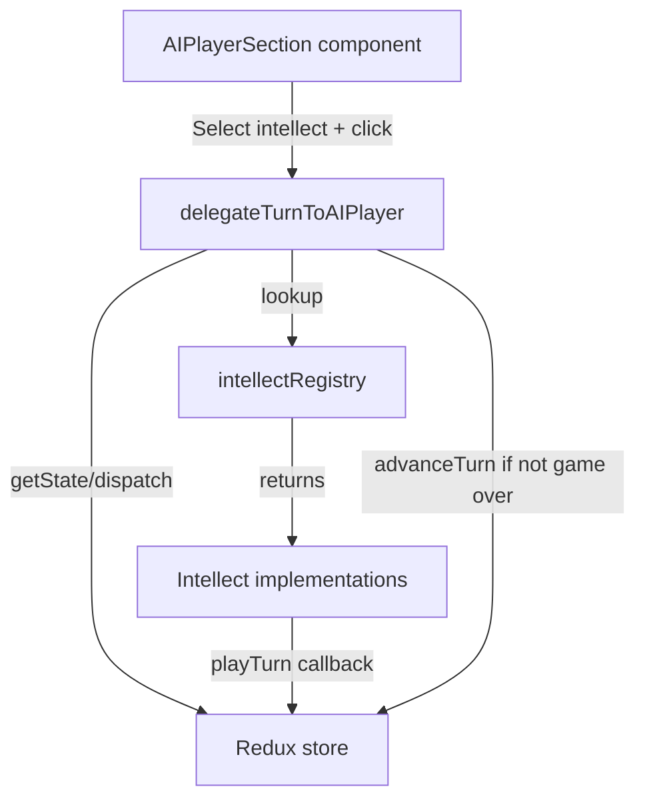

# AI Player Feature Implementation

## Architecture Overview




## Implementation Steps

### 1. Create AI Player Types and Registry

Create the core types and intellect registry in [`web/src/lib/ai/`](web/src/lib/ai/):

- `types.ts` - Define `AIPlayerIntellect` type with `playTurn(getState, dispatch)` signature
- `intellectRegistry.ts` - Map intellect names to implementations
```typescript
// types.ts
export type AIPlayerIntellect = {
  name: string
  playTurn: (getState: () => GameState, dispatch: AppDispatch) => void
}
```


### 2. Create Intellect Implementations

Create intellect files in [`web/src/lib/ai/intellects/`](web/src/lib/ai/intellects/):

- `doNothingIntellect.ts` - Simply returns without any actions
- `basicIntellect.ts` - Makes decisions about hiring, assignments, missions, upgrades

The Basic intellect will:

- Hire agents when funds allow and below cap
- Assign available agents to contracting or missions
- Deploy agents to high-priority defensive missions (by operation level and expiry)
- Consider training when appropriate
- Focus on preventing panic from reaching 100%

### 3. Create Delegation Function

Create [`web/src/lib/ai/delegateTurnToAIPlayer.ts`](web/src/lib/ai/delegateTurnToAIPlayer.ts):

```typescript
export function delegateTurnToAIPlayer(intellectName: string): void {
  const intellect = getIntellect(intellectName)
  const getState = () => store.getState().undoable.present.gameState
  
  intellect.playTurn(getState, store.dispatch)
  
  if (!isGameOver(getState()) && !isGameWon(getState())) {
    store.dispatch(advanceTurn())
  }
}
```


### 4. Create UI Component

Add new component [`web/src/components/GameControls/AIPlayerSection.tsx`](web/src/components/GameControls/AIPlayerSection.tsx):

- MUI `Select` dropdown for intellect selection
- "Delegate to AI" button that calls `delegateTurnToAIPlayer`
- Disable button when game is over/won
- Wrap in `ExpandableCard` to match existing style

### 5. Integrate into GameControls

Update [`web/src/components/GameControls/GameControls.tsx`](web/src/components/GameControls/GameControls.tsx):

- Import and add `AIPlayerSection` at the bottom of the component

### 6. Add Event Logging

Update [`web/src/redux/eventsMiddleware.ts`](web/src/redux/eventsMiddleware.ts):

- No action needed for individual player actions (already logged)
- The AI's dispatched actions will automatically be logged by existing middleware

## File Structure

```javascript
web/src/lib/ai/
├── types.ts
├── delegateTurnToAIPlayer.ts
├── intellectRegistry.ts
└── intellects/
    ├── doNothingIntellect.ts
    └── basicIntellect.ts

web/src/components/GameControls/
├── AIPlayerSection.tsx  (new)
└── GameControls.tsx     (modified)
```


## Key Implementation Notes