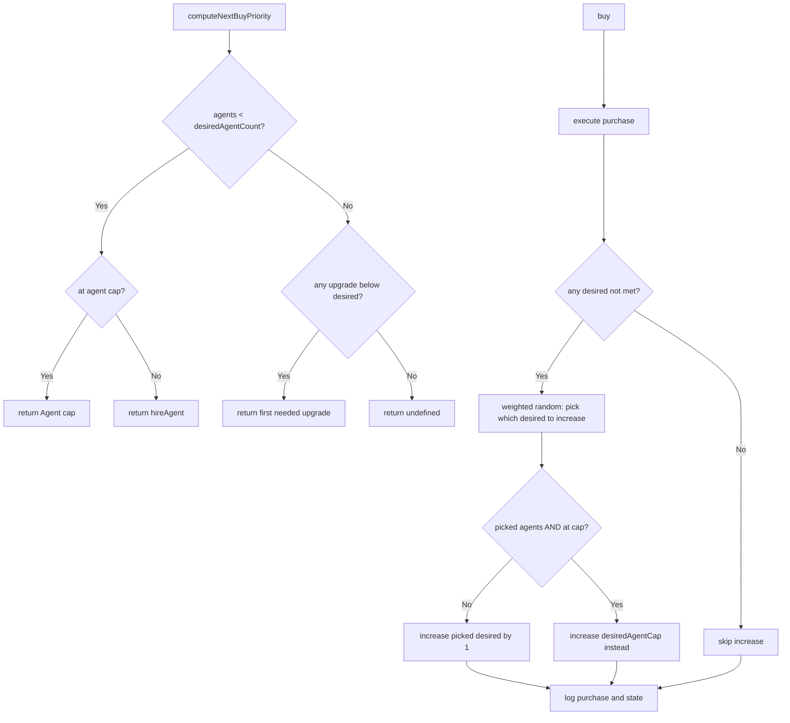

# Rewrite Basic Intellect Buy Priority System

## Overview

Replace the current turn-based `computeDesiredXCount` logic with a persistent state that tracks desired counts, initialized at game start and reset when the game is reset. After each purchase, the AI will randomly (with weighted probabilities) increase one of the desired counts.

## Key Design Decisions

1. **State Location**: Module-level variable in [`basicIntellect.ts`](web/src/ai/intellects/basicIntellect.ts) with an exported reset function
2. **Reset Hook**: Call reset from [`ResetControls.tsx`](web/src/components/GameControls/ResetControls.tsx) after dispatching the reset action
3. **Weights**: 50% chance for agents, 50% split evenly among the 7 upgrade types (~7% each)

## Data Model

New `BasicIntellectState` type with desired counts:

```typescript
type BasicIntellectState = {
  desiredAgentCount: number      // starts at 4 (initial agent count)
  desiredAgentCap: number        // starts at AGENT_CAP (20)
  desiredTransportCap: number    // starts at TRANSPORT_CAP (6)
  desiredTrainingCap: number     // starts at TRAINING_CAP (0)
  desiredWeaponDamage: number    // starts at initial weapon damage
  desiredTrainingSkillGain: number
  desiredExhaustionRecovery: number
  desiredHitPointsRecoveryPct: number
}
```


## Algorithm




## Files to Modify

### 1. [`web/src/ai/intellects/basicIntellect.ts`](web/src/ai/intellects/basicIntellect.ts)

- Add `BasicIntellectState` type
- Add module-level `state` variable with initial values
- Export `resetBasicIntellectState()` function and `getBasicIntellectState()` for debugging
- Rewrite `computeNextBuyPriority()` to use desired counts from state
- Rewrite `buy()` to:
- Execute the purchase
- Call `maybeIncreaseDesiredCount()` to randomly increase a desired count
- Log results
- Remove old `computeDesiredXCount()` and `shouldBuyX()` functions

### 2. [`web/src/components/GameControls/ResetControls.tsx`](web/src/components/GameControls/ResetControls.tsx)

- Import `resetBasicIntellectState` from basicIntellect
- Call `resetBasicIntellectState()` in `handleResetGame()` after dispatching reset

### 3. [`web/src/ai/intellectRegistry.ts`](web/src/ai/intellectRegistry.ts)

- Re-export `resetBasicIntellectState` for external access (optional, depends on import path preferences)

## Weight Distribution

For weighted randomization after each purchase:

- Agents: 50%
- Agent cap: ~7%
- Transport cap: ~7%
- Training cap: ~7%
- Weapon damage: ~7%
- Training skill gain: ~7%
- Exhaustion recovery: ~7%
- Hit points recovery: ~7%

## Logging Format

At end of `buy()`:

```javascript
buy: Purchased [item]. Increased desired [category] to [value]. 
  Desired counts: agents=5, agentCap=20, transportCap=7, trainingCap=1, ...


```