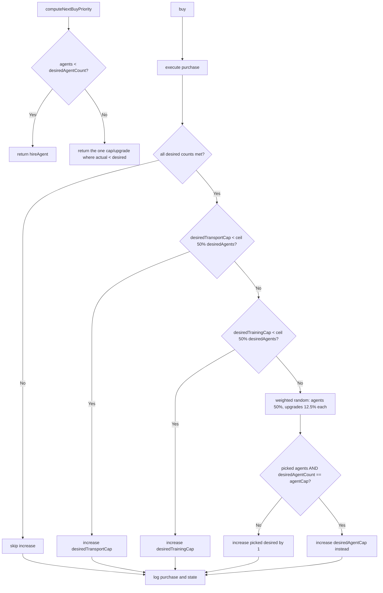

# Rewrite Basic Intellect Buy Priority System

## Overview

Replace the current turn-based `computeDesiredXCount` logic with a persistent state that tracks desired counts, initialized at game start and reset when the game is reset. After each purchase, **only if all desired counts are currently met**, the AI will randomly (with weighted probabilities) increase one of the desired counts by 1. This represents the AI "raising its ambitions" after achieving its current goals.

## Key Design Decisions

1. **State Location**: Module-level variable in [`basicIntellect.ts`](web/src/ai/intellects/basicIntellect.ts) with an exported reset function
2. **Reset Hook**: Call reset from [`ResetControls.tsx`](web/src/components/GameControls/ResetControls.tsx) after dispatching the reset action
3. **Weights**: Priority picks for transport/training cap (based on agent count), then weighted random (50% agents, 12.5% each for 4 upgrades)

## Data Model

New `BasicIntellectState` type with desired counts:

```typescript
type BasicIntellectState = {
  desiredAgentCount: number      // starts at 4 (initial agent count)
  desiredAgentCap: number        // starts at AGENT_CAP (20)
  desiredTransportCap: number    // starts at TRANSPORT_CAP (6)
  desiredTrainingCap: number     // starts at TRAINING_CAP (0)
  desiredWeaponDamage: number    // starts at initial weapon damage
  desiredTrainingSkillGain: number
  desiredExhaustionRecovery: number
  desiredHitPointsRecoveryPct: number
}
```

## Key Invariants

1. **`desiredAgentCount <= agentCap` always holds.** When the weighted randomization picks "agents" but `desiredAgentCount` would exceed `agentCap`, we increase `desiredAgentCap` instead.
2. **At most ONE cap/upgrade can be above actual, and exactly by 1.** This is because desired counts only increase by 1 after a successful purchase, and the AI buys that item before any other desired count can increase.
3. **When `agents < desiredAgentCount`, all caps/upgrades equal their actual values.** The only way for a cap/upgrade to be above actual is if the AI just increased it (after buying the previous goal). But that can only happen when all agent goals were already met.

## Algorithm



**Note**: `computeNextBuyPriority` always returns a value. The initialization logic must run the "pick which desired to increase" logic to ensure there's always exactly one goal to pursue.

## Files to Modify

### 1. [`web/src/ai/intellects/basicIntellect.ts`](web/src/ai/intellects/basicIntellect.ts)

- Add `BasicIntellectState` type
- Add module-level `state` variable with initial values
- Export `resetBasicIntellectState()` function (must run weighted random to set first goal) and `getBasicIntellectState()` for debugging
- Rewrite `computeNextBuyPriority()` to use desired counts from state
- Rewrite `buy()` to:
- Execute the purchase
- Check if all desired counts are met; if so, call `increaseRandomDesiredCount()` to raise ambitions
- Log what was bought, what desired count increased (if any), and all current desired counts
- Remove old `computeDesiredXCount()` and `shouldBuyX()` functions

### 2. [`web/src/components/GameControls/ResetControls.tsx`](web/src/components/GameControls/ResetControls.tsx)

- Import `resetBasicIntellectState` from basicIntellect
- Call `resetBasicIntellectState()` in `handleResetGame()` after dispatching reset

### 3. [`web/src/ai/intellectRegistry.ts`](web/src/ai/intellectRegistry.ts)

- Re-export `resetBasicIntellectState` for external access (optional, depends on import path preferences)

## Weight Distribution

When picking which desired count to increase after a purchase:

**Priority picks (deterministic, checked first):**

1. **Transport cap**: Always picked if `desiredTransportCap < ceil(desiredAgentCount * 0.5)`
2. **Training cap**: Picked if `desiredTrainingCap < ceil(desiredAgentCount * 0.5)` AND transport cap wasn't picked

**Weighted random (if no priority pick):**

- Agents: 50%
- Weapon damage: 12.5%
- Training skill gain: 12.5%
- Exhaustion recovery: 12.5%
- Hit points recovery: 12.5%

**Special case:**

- **Agent cap**: Picked instead of "agents" if `desiredAgentCount == agentCap`

## Logging Format

At end of `buy()`:

```javascript
buy: Purchased [item]. [Increased desired [category] to [value] | No increase (goals not yet met)].
  Desired counts: agents=5, agentCap=20, transportCap=7, trainingCap=1, ...


```