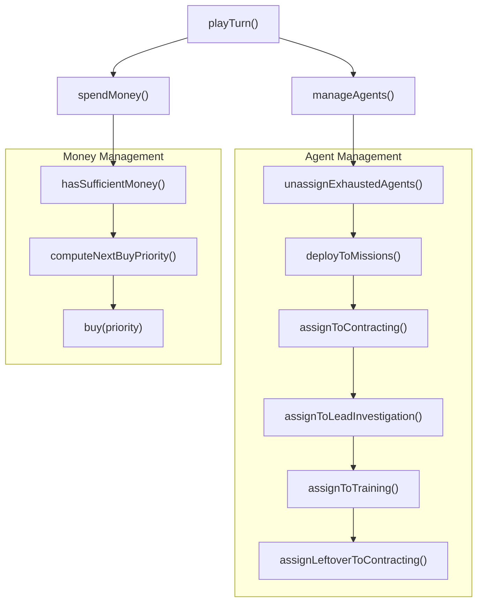

# Basic AI Player Intellect Implementation

This plan implements the `basicIntellect` as an `AIPlayerIntellect` following the detailed spec in [`docs/design/about_basic_intellect.md`](docs/design/about_basic_intellect.md).

## Architecture Overview




## File Structure

Create a new file [`web/src/ai/intellects/basicIntellect.ts`](web/src/ai/intellects/basicIntellect.ts) with helper functions organized by the algorithm structure.

## Key Constants (from spec)

| Constant | Value | Purpose |
|----------|-------|---------|
| Exhaustion threshold | 5% | Agents above this are considered exhausted |
| Ready agents minimum | 20% | If below, don't assign/deploy agents |
| Income target multiplier | 1.2 | Contracting income should cover 120% of upkeep |
| Threat target multiplier | 1.2 | Deploy agents with 120% of enemy threat |
| Savings turns | 5 | Keep enough money for 5 turns |
| Uncovered upkeep ratio | 0.5 | Assume only 50% upkeep covered when calculating savings |

## Implementation Details

### 1. Main Entry Point

```typescript
export const basicIntellect: AIPlayerIntellect = {
  name: 'Basic',
  playTurn(api: PlayTurnAPI): void {
    manageAgents(api)
    spendMoney(api)
  },
}
```


### 2. Agent Selection Helper

The `selectNextBestReadyAgent()` function is core to the algorithm - it selects agents in Available or InTraining state with exhaustion below 5%, prioritizing lowest exhaustion:

- Filter to agents with `state === 'Available'` or `state === 'InTraining'`
- Check if at least 20% of total agents are in-base
- Exclude agents with `exhaustionPct >= 5%`
- Pick agent with lowest exhaustion (random if tied)
- Mark selected agent so it won't be picked again in same turn

### 3. Existing Utilities to Leverage

| Function | File | Purpose |
|----------|------|---------|
| `getAgentUpkeep()` | [`web/src/lib/ruleset/moneyRuleset.ts`](web/src/lib/ruleset/moneyRuleset.ts) | Calculate upkeep costs |
| `getContractingIncome()` | [`web/src/lib/ruleset/moneyRuleset.ts`](web/src/lib/ruleset/moneyRuleset.ts) | Calculate contracting income |
| `calculateMissionThreatAssessment()` | [`web/src/lib/game_utils/missionThreatAssessment.ts`](web/src/lib/game_utils/missionThreatAssessment.ts) | Mission threat calculation |
| `notTerminated()`, `available()`, `onTrainingAssignment()` | [`web/src/lib/model_utils/agentUtils.ts`](web/src/lib/model_utils/agentUtils.ts) | Agent filtering |
| `filterMissionsByState()` | [`web/src/lib/model_utils/missionUtils.ts`](web/src/lib/model_utils/missionUtils.ts) | Mission filtering |
| `getUpgradePrice()` | [`web/src/lib/data_tables/upgrades.ts`](web/src/lib/data_tables/upgrades.ts) | Upgrade costs |

### 4. HQ Raid Detection

HQ assault missions (defensive level 6) can be detected via `mission.operationLevel === 6`. These are the "existential" missions that should be prioritized.

### 5. Lead Selection

Leads have a `repeatable` boolean field. Prioritize non-repeatable leads (`lead.repeatable === false`) over repeatable ones.

### 6. Registry Update

Register the new intellect in [`web/src/ai/intellectRegistry.ts`](web/src/ai/intellectRegistry.ts):

```typescript
const intellects: Record<string, AIPlayerIntellect> = {
  'do-nothing': doNothingIntellect,
  'basic': basicIntellect,
}

```