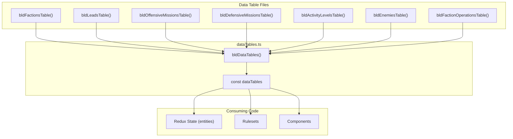

# Centralize Collections into `dataTables` Constant

## Architecture Overview



## Key Changes

### Eliminate "Def" Types

The following intermediate "Def" types are deleted - code uses data table types directly:

| Deleted Type | Replaced By |

|--------------|-------------|

| `MissionDef` | `OffensiveMissionData` / `DefensiveMissionData` |

| `FactionActivityLevelDef` | `FactionActivityLevelData` |

### Entity Types Remain

Entity types with runtime state remain in Redux `GameState`. They are constructed from data tables:

| Entity Type | Constructed From | Location |

|-------------|------------------|----------|

| `Faction` | `dataTables.factions` | `GameState.factions` |

| `Mission` | `dataTables.offensiveMissions` / `dataTables.defensiveMissions` | `GameState.missions` |

| `Lead` | `dataTables.leads` | Used directly (constant) |

| `LeadInvestigation` | Runtime | `GameState.leadInvestigations` |

| `Agent` | Runtime | `GameState.agents` |

### New Type: `MissionDataId`

- Replace `MissionDefId = 'missiondef-${string}'` with `MissionDataId = 'missiondata-${string}'`
- `Mission.missionDefId` becomes `Mission.missionDataId`
- Both `OffensiveMissionData` and `DefensiveMissionData` will have `id: MissionDataId`

### Data Tables Structure

```typescript
type DataTables = {
  readonly factions: readonly FactionData[]
  readonly leads: readonly LeadData[]                         // Template-expanded
  readonly offensiveMissions: readonly OffensiveMissionData[] // Template-expanded
  readonly defensiveMissions: readonly DefensiveMissionData[] // Template-expanded
  readonly activityLevels: readonly FactionActivityLevelData[]
  readonly enemies: readonly EnemyData[]
  readonly factionOperations: readonly FactionOperationData[]
}
```

### Template Expansion

- `bldDataTables()` handles all template expansion (`{facId}`, `{facName}`)
- Individual builder functions return raw data; `bldDataTables()` expands as needed
- Final `dataTables` contains fully expanded, immutable data

---

## Implementation Steps

### Phase 1: Create Core Infrastructure

1. **Create [`web/src/lib/collections/dataTables.ts`](web/src/lib/collections/dataTables.ts)**

   - Define `DataTables` type with all readonly arrays
   - Create `bldDataTables()` function that orchestrates building
   - Export `dataTables` constant initialized via `bldDataTables()`
   - Move `expandTemplateString()` here from `factions.ts`

2. **Add `MissionDataId` and update mission data types**

   - Add `MissionDataId` type: `'missiondata-${string}'`
   - Add `id: MissionDataId` field to `OffensiveMissionData` type
   - Add `id: MissionDataId` field to `DefensiveMissionData` type
   - IDs will be generated during template expansion in `bldDataTables()`

### Phase 2: Convert Data Table Files to Builder Functions

3. **Refactor [`factionsDataTable.ts`](web/src/lib/collections/factionsDataTable.ts)**

   - Change `export const FACTIONS_DATA_TABLE` to `export function bldFactionsTable(): FactionData[]`
   - Keep `FactionData` and `FactionOperationData` types exported
   - Add `bldFactionOperationsTable()` builder

4. **Refactor [`leadsDataTable.ts`](web/src/lib/collections/leadsDataTable.ts)**

   - Change to `export function bldLeadsTable(): LeadData[]`
   - Template expansion will happen in `bldDataTables()`

5. **Refactor [`offensiveMissionsDataTable.ts`](web/src/lib/collections/offensiveMissionsDataTable.ts)**

   - Change to `export function bldOffensiveMissionsTable(): OffensiveMissionData[]`

6. **Refactor [`defensiveMissionsDataTable.ts`](web/src/lib/collections/defensiveMissionsDataTable.ts)**

   - Change to `export function bldDefensiveMissionsTable(): DefensiveMissionData[]`

7. **Refactor [`factionActivityLevelDefsDataTable.ts`](web/src/lib/collections/factionActivityLevelDefsDataTable.ts)**

   - Change to `export function bldActivityLevelsTable(): FactionActivityLevelData[]`

8. **Refactor [`enemiesDataTable.ts`](web/src/lib/collections/enemiesDataTable.ts)**

   - Change to `export function bldEnemiesTable(): EnemyData[]`

### Phase 3: Delete Redundant Collection Files

9. **Delete wrapper collection files:**

   - Delete [`factions.ts`](web/src/lib/collections/factions.ts) - move `getFactionShortId()` to `dataTables.ts`
   - Delete [`leads.ts`](web/src/lib/collections/leads.ts) - move lookup functions to appropriate locations
   - Delete [`missions.ts`](web/src/lib/collections/missions.ts) - core logic moves to `dataTables.ts`
   - Delete [`factionActivityLevelDefs.ts`](web/src/lib/collections/factionActivityLevelDefs.ts)
   - Delete [`factionOperations.ts`](web/src/lib/collections/factionOperations.ts)

### Phase 4: Update Model Types

10. **Update [`missionModel.ts`](web/src/lib/model/missionModel.ts)**

    - Replace `MissionDefId` with `MissionDataId`
    - Delete `MissionDef` type
    - Update `Mission.missionDefId` to `Mission.missionDataId`

11. **Delete `FactionActivityLevelDef` type**

    - Currently in [`factionActivityLevelDefs.ts`](web/src/lib/collections/factionActivityLevelDefs.ts)
    - All consumers use `FactionActivityLevelData` directly from `dataTables.activityLevels`
    - The processing logic (converting `''` to `Infinity`/`0`) moves to `bldDataTables()`

12. **Keep `Faction` entity type** (no changes needed)

    - `Faction` in [`factionModel.ts`](web/src/lib/model/factionModel.ts) stays as-is
    - Has runtime state (`turnsAtCurrentLevel`, `suppressionTurns`, etc.)
    - Constructed from `dataTables.factions` in initial state builders

### Phase 5: Update All Consumers

13. **Update consuming files** (~20 files) to:

    - Import from `dataTables` instead of individual collection files
    - Use `dataTables.offensiveMissions`, `dataTables.defensiveMissions`, `dataTables.leads`, etc.
    - Replace `MissionDef` references with `OffensiveMissionData | DefensiveMissionData`
    - Replace `FactionActivityLevelDef` references with `FactionActivityLevelData`
    - Replace `missionDefId` with `missionDataId`
    - Replace `getMissionDefById()` with `getMissionDataById()` lookup
    - Replace `getFactionActivityLevelDefByOrd()` with `getActivityLevelByOrd()` lookup

Key files to update:

- [`missionFactory.ts`](web/src/lib/game_utils/missionFactory.ts)
- [`evaluateTurn.ts`](web/src/lib/game_utils/turn_advancement/evaluateTurn.ts)
- [`evaluateDeployedMission.ts`](web/src/lib/game_utils/turn_advancement/evaluateDeployedMission.ts)
- [`activityLevelRuleset.ts`](web/src/lib/ruleset/activityLevelRuleset.ts)
- [`initialState.ts`](web/src/lib/ruleset/initialState.ts)
- [`debugInitialState.ts`](web/src/lib/ruleset/debugInitialState.ts)
- Components: `MissionDetailsCard.tsx`, `MissionsDataGrid.tsx`, `LeadsDataGrid.tsx`, etc.

### Phase 6: Add Lookup Utilities

14. **Add lookup functions to `dataTables.ts`:**

    - `getOffensiveMissionDataById(id: MissionDataId): OffensiveMissionData`
    - `getDefensiveMissionDataById(id: MissionDataId): DefensiveMissionData`
    - `getMissionDataById(id: MissionDataId): OffensiveMissionData | DefensiveMissionData` (searches both)
    - `getLeadById(id: LeadId): LeadData`
    - `getFactionDataById(id: FactionId): FactionData`
    - `getActivityLevelByOrd(ord: FactionActivityLevelOrd): FactionActivityLevelData`
    - `getEnemyByType(type: EnemyType): EnemyData`
    - `getFactionOperationByLevel(level: number): FactionOperationData`