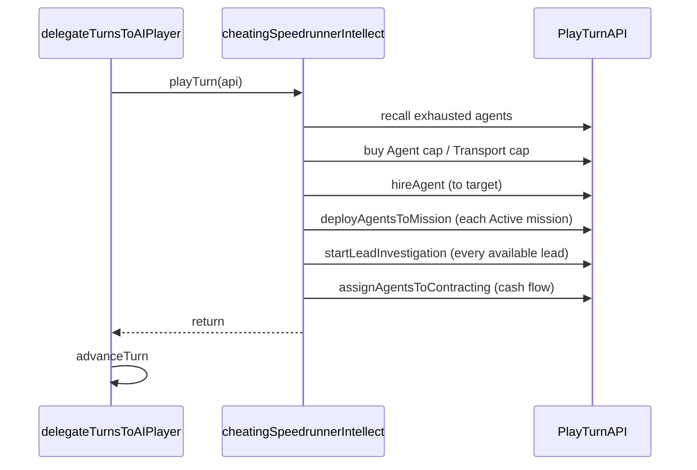

# Cheating Speedrunner Intellect

## Background

The authoring contract for all intellects is documented in
[docs/ai/about_ai_player_intellect.md](docs/ai/about_ai_player_intellect.md) and is
followed here without deviation.

Per [docs/backlog/long_playthrough_research.md](docs/backlog/long_playthrough_research.md), the two reasons `basicIntellect` needs ~210 turns when cheating are:

1. It investigates only one repeatable lead at a time (serial faction progression).
2. It gates repeatable-lead selection behind `canDeployMissionWithCurrentResources` combat-rating checks, stalling on tier transitions.

With `setupCheatingGameState()`:
- `rand.set('lead-investigation', 1)` makes any investigation with > 0 accumulated intel succeed on the next turn's roll (investigations complete in exactly 2 turns regardless of difficulty).
- `rand.set('agent_attack_roll', 1)` + `rand.set('enemy_attack_roll', 0)` make all combats trivially won.
- Starting money is 100,000.

Theoretical parallel minimum is ~46 turns; this intellect targets ~50-80 turns.

## Design

### File layout

Mirror [web/src/ai/intellects/basic/](web/src/ai/intellects/basic/) as a new self-contained folder so the new intellect does not couple to `basic/` internals:

- [web/src/ai/intellects/cheatingSpeedrunner/cheatingSpeedrunnerIntellect.ts](web/src/ai/intellects/cheatingSpeedrunner/cheatingSpeedrunnerIntellect.ts) - entry point
- [web/src/ai/intellects/cheatingSpeedrunner/constants.ts](web/src/ai/intellects/cheatingSpeedrunner/constants.ts) - tuning constants
- [web/src/ai/intellects/cheatingSpeedrunner/purchasing.ts](web/src/ai/intellects/cheatingSpeedrunner/purchasing.ts) - hiring + cap upgrades only
- [web/src/ai/intellects/cheatingSpeedrunner/missionDeployment.ts](web/src/ai/intellects/cheatingSpeedrunner/missionDeployment.ts) - deploy without combat-rating gate
- [web/src/ai/intellects/cheatingSpeedrunner/leadInvestigation.ts](web/src/ai/intellects/cheatingSpeedrunner/leadInvestigation.ts) - parallel: start every available lead
- [web/src/ai/intellects/cheatingSpeedrunner/contracting.ts](web/src/ai/intellects/cheatingSpeedrunner/contracting.ts) - minimum viable cash flow
- [web/src/ai/intellects/cheatingSpeedrunner/agentAllocation.ts](web/src/ai/intellects/cheatingSpeedrunner/agentAllocation.ts) - shared helpers for picking ready agents (thin local copy of what is needed)

### Intellect name and registration

Add to [web/src/ai/intellectRegistry.ts](web/src/ai/intellectRegistry.ts):

```ts
'cheating-speedrunner': cheatingSpeedrunnerIntellect,
```

Display `name` field: `'Cheating Speedrunner'`. The UI's dropdown in [web/src/components/GameControls/AIPlayerCard.tsx](web/src/components/GameControls/AIPlayerCard.tsx) picks this up automatically via `getAllIntellectNames()`.

### Per-turn algorithm

In priority order, using only [PlayTurnAPI](web/src/lib/model_utils/playTurnApiTypes.ts):

1. **Purchase phase** - `purchasing.ts`:
   - Buy `Agent cap` upgrades until `agentCap >= TARGET_AGENT_COUNT` (default 60).
   - Buy `Transport cap` upgrades until `transportCap >= TARGET_TRANSPORT_CAP` (default 40, enough for Raid HQ which needs `ceil(111/3) = 37` agents).
   - Hire agents (`hireAgent`) until `agents.length >= TARGET_AGENT_COUNT`.
   - Skip all stat upgrades (hit points, weapon damage, training gain, recovery) - irrelevant when combat always succeeds.
   - Stop when money would drop below a small safety floor (e.g. `upkeep * 3`); contracting handles recurring cash flow.

2. **Mission deployment** - `missionDeployment.ts`:
   - For every `Active` mission, pick the earliest expiring first, HQ raids (level 6 defensive) first.
   - Deploy with `ceil(enemies.length / MAX_ENEMIES_PER_AGENT)` agents - using the same per-agent enemy cap as basic (3) to cap per-agent exhaustion during long battles.
   - Do NOT check combat rating; combat is guaranteed to win.
   - Check only transport capacity and agent availability.

3. **Lead investigation** - `leadInvestigation.ts`:
   - Call `getAvailableLeadsForInvestigation(gameState)` from [web/src/lib/model_utils/leadUtils.ts](web/src/lib/model_utils/leadUtils.ts) (skip `lead-deep-state`).
   - Start an investigation on EVERY available lead, not just one. One agent per lead is sufficient because any non-zero intel wins the next roll.
   - Skip the `canDeployMissionWithCurrentResources` gate entirely.
   - Use 1 agent for repeatable leads; keep the existing `ceil(difficulty / 8)` heuristic only for the final `lead-peace-on-earth` (D=200) to avoid the theoretical 1-agent case giving intel rounding issues - but since cheat roll always wins on any > 0 intel, 1 agent should suffice there too.

4. **Contracting fill** - `contracting.ts`:
   - Compute `getMoneyTurnDiff(gameState)` from [web/src/lib/ruleset/moneyRuleset.ts](web/src/lib/ruleset/moneyRuleset.ts).
   - If negative, assign just enough ready agents to contracting to bring it to zero or slightly positive. No 120% coverage target.

5. **Recall exhausted** (first, before allocation): agents at > `MAX_EXHAUSTION_ALLOWED_ON_ASSIGNMENT` (30%) get recalled so they recover on Standby.

### Constants ([web/src/ai/intellects/cheatingSpeedrunner/constants.ts](web/src/ai/intellects/cheatingSpeedrunner/constants.ts))

- `TARGET_AGENT_COUNT = 60`
- `TARGET_TRANSPORT_CAP = 40`
- `MAX_ENEMIES_PER_AGENT = 3` (same as basic)
- `MAX_EXHAUSTION_ALLOWED_ON_ASSIGNMENT = 30`
- `MONEY_SAFETY_FLOOR_TURNS = 3` (stop spending when money < 3 turns of upkeep)

### Control flow diagram



### Entry point ([cheatingSpeedrunnerIntellect.ts](web/src/ai/intellects/cheatingSpeedrunner/cheatingSpeedrunnerIntellect.ts))

```ts
export const cheatingSpeedrunnerIntellect: AIPlayerIntellect = {
  name: 'Cheating Speedrunner',
  playTurn(api: PlayTurnAPI): void {
    recallExhausted(api)
    spendMoney(api)
    deployToAllMissions(api)
    startAllAvailableInvestigations(api)
    fillContractingForCashFlow(api)
    log.info('ai', `Finished playing turn ${api.gameState.turn}`)
  },
}
```

### Reuse considerations

- `getAvailableLeadsForInvestigation`, `getMoneyTurnDiff`, `canParticipateInBattle`, `getRemainingTransportCap`: reused from `lib/` (OK per dependency rules - see "Invariants and rules for intellect authors" in [about_ai_player_intellect.md](../../docs/ai/about_ai_player_intellect.md)).
- Agent selection (`ready` filter, sort by lowest exhaustion): implemented locally as a small helper in `agentAllocation.ts`. This duplicates ~10 LOC of what `basic/agentSelection.ts` does but keeps intellects decoupled per AGENTS.md guidance.

### Authoring contract compliance

Per [about_ai_player_intellect.md](../../docs/ai/about_ai_player_intellect.md), the
intellect:

- Reads state only through `api.gameState` (and never `api.aiState`, since this
  intellect keeps no cross-turn bookkeeping).
- Computes every precondition from `api.gameState` before dispatching an action
  (agent readiness, transport slack, lead availability, money floor). It never
  branches on `ActionResult.success === false`; strict-mode violations throw and
  surface as bugs.
- Does not dispatch `advanceTurn` itself; the engine owns turn advancement.
- Does not cache collections across action calls. After each `api.*(...)` call,
  the intellect re-reads `api.gameState` rather than reusing prior arrays.
- Does not call `updateCachedGameState()`; no external state mutation is
  performed, so the automatic post-action refresh is sufficient.

### Test

Create [web/test/ai/cheatingSpeedrunner.test.ts](web/test/ai/cheatingSpeedrunner.test.ts) modeled on [web/test/ai/basicIntellect.test.ts](web/test/ai/basicIntellect.test.ts):

```ts
test('Cheating Speedrunner wins game within 80 turns while cheating', () => {
  const store = getStore()
  setupCheatingGameState()
  delegateTurnsToAIPlayer('cheating-speedrunner', 80)
  const finalState = getCurrentTurnStateFromStore(store)
  expect(isGameWon(finalState)).toBe(true)
  console.log(`Turn: ${finalState.turn}, agents: ${finalState.agents.length}, terminated: ${finalState.terminatedAgents.length}`)
})
```

The 80-turn budget has safety margin over the 46-turn theoretical parallel minimum. If the run exceeds this, the log output plus existing `log.info('ai', ...)` calls identify the stall.

### Strategy documentation

Following the convention set by `about_basic_intellect*.md` (intellect-specific
heuristics live next to each intellect), add a short design doc at
[docs/ai/about_cheating_speedrunner_intellect.md](docs/ai/about_cheating_speedrunner_intellect.md)
covering: prerequisites (`setupCheatingGameState()`), the cheat mechanics it
exploits, the per-turn algorithm, and the tuning constants. Cross-link from
[docs/ai/about_ai_player_intellect.md](docs/ai/about_ai_player_intellect.md)'s
"See also" section.

### Assumptions and trade-offs

- No explicit check that `setupCheatingGameState()` was called. The intellect is designed for that environment but will still run otherwise; it just will not perform well (missions may be lost when combat is not rigged, investigations will stall). Documented clearly in the file header comment.
- Skipping training and stat upgrades is intentional and will make the intellect strictly worse than `basicIntellect` outside the cheating setup.
- `addAgentsToInvestigation` is not used in this intellect; parallel-across-leads is strictly better than piling on one lead because investigations complete in 2 turns flat.

## Verification

Run `qcheck` per [AGENTS.md](AGENTS.md) after implementation. Expect:

- Lint/format clean.
- New test passes, reporting a turn count well below 210 (target: under 80; likely 50-70).
- Existing `basicIntellect.test.ts` unaffected.
