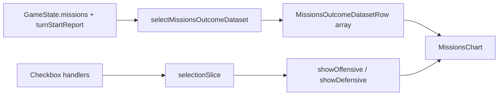

# Create Missions Stacked Bar Chart

## Overview

Replace the inline Missions LineChart in ChartsScreen with a new dedicated `MissionsChart` component featuring:

- Two side-by-side stacked bars per turn (Defensive on left, Offensive on right)
- Three stacked segments per bar: Won (green), Lost (red), Expired (dark red)
- Toggle checkboxes for Offensive/Defensive visibility stored in Redux

## Files to Modify

### 1. Redux Selection Slice ([web/src/redux/slices/selectionSlice.ts](web/src/redux/slices/selectionSlice.ts))

Add two new boolean state properties with reducers:

- `missionsChartShowOffensive?: boolean` (defaults to true when undefined)
- `missionsChartShowDefensive?: boolean` (defaults to true when undefined)

Add corresponding reducers: `setMissionsChartShowOffensive`, `setMissionsChartShowDefensive`

### 2. Charts Selectors ([web/src/redux/selectors/chartsSelectors.ts](web/src/redux/selectors/chartsSelectors.ts))

Add new dataset type `MissionsOutcomeDatasetRow` with:

- `turn`: number
- `offensiveWon`, `offensiveLost`, `offensiveExpired`: number (cumulative)
- `defensiveWon`, `defensiveLost`, `defensiveExpired`: number (cumulative)

Use the mission's `operationLevel` field to classify:

- `operationLevel === undefined` = Offensive (player apprehend/raid)
- `operationLevel !== undefined` = Defensive (faction operations)

Combine "Retreated" and "Wiped" into "Lost" category.

### 3. New MissionsChart Component ([web/src/components/Charts/MissionsChart.tsx](web/src/components/Charts/MissionsChart.tsx))

Create using `BarChart` from `@mui/x-charts/BarChart`:

- Use stacking with two stack groups: `'offensive'` and `'defensive'`
- Series filtered based on Redux checkbox state
- Colors from MUI palette:
  - Won: `green[600]`
  - Lost: `red[600]`
  - Expired: `red[900]` (dark red)
- Checkboxes rendered in a `Box` beside the chart legend area

### 4. ChartsScreen ([web/src/components/Charts/ChartsScreen.tsx](web/src/components/Charts/ChartsScreen.tsx))

- Remove inline Missions LineChart (lines 111-140)
- Import and use new `MissionsChart` component
- Pass required props: `gameStates`, `height`

## Data Flow

## Color Scheme (MUI palette)

| Outcome | Color |

|---------|-------|

| Won | `green[600]` - bright green |

| Lost | `red[600]` - standard red |

| Expired | `red[900]` - dark red |
