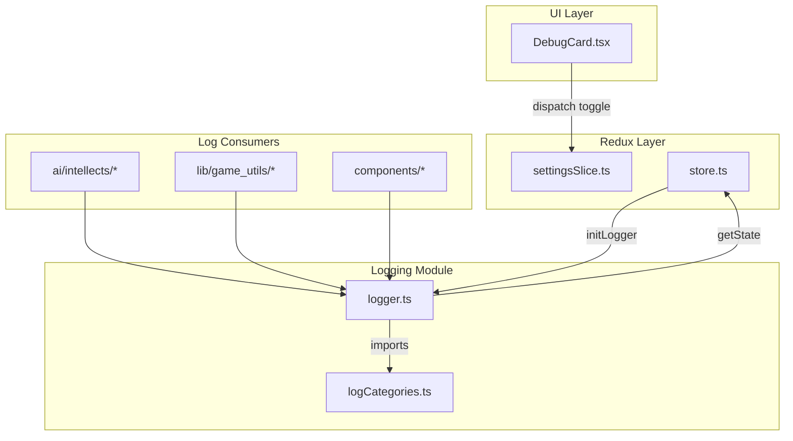

# Custom Logger Implementation

## Architecture Overview

## Key Design Decisions

1. **Logger location**: New `web/src/logging/` directory - sits outside `lib/` to allow Redux access while remaining importable by both AI and lib code via a setter pattern
2. **State access pattern**: Logger uses a `setStoreGetter()` function called during app init, avoiding circular dependencies
3. **UI placement**: Add log category toggles to existing [DebugCard.tsx](web/src/components/DebugCard.tsx) since it already contains debug settings
4. **Categories based on your spec**: 9 categories with emoji badges and distinct colors

## Implementation Steps

### 1. Create logging module

Create [web/src/logging/logCategories.ts](web/src/logging/logCategories.ts):

- Define `LOG_CATEGORIES` const with badge and color for each category
- Export `LogCategory` type

Create [web/src/logging/logger.ts](web/src/logging/logger.ts):

- `setStoreGetter(getter)` - called once at init to provide store access
- `log.info(category, message, ...args)` - styled log with category badge
- `log.success(category, message)` - green checkmark styling
- `log.warn(category, message, ...args)` - warning output
- `log.group(category, label, fn)` - collapsible console group
- `log.table(category, label, data)` - tabular data output

### 2. Update settings slice

Modify [web/src/redux/slices/settingsSlice.ts](web/src/redux/slices/settingsSlice.ts):

- Add `enabledLogCategories: Partial<Record<LogCategory, boolean>>` to `SettingsState`
- Add `toggleLogCategory(category)` reducer
- Default all categories to `false` (opt-in logging)

### 3. Initialize logger at app startup

Modify [web/src/main.tsx](web/src/main.tsx):

- Import and call `setStoreGetter(() => getStore())` after `initStore()` completes

### 4. Add UI toggles

Modify [web/src/components/DebugCard.tsx](web/src/components/DebugCard.tsx):

- Add a "Console Logging" section with checkboxes for each category
- Use `FormControlLabel` + `Checkbox` pattern consistent with existing controls

### 5. Migrate existing console.log calls

Replace `console.log` calls in:

- [web/src/ai/intellects/basic/*.ts](web/src/ai/intellects/basic/) - AI decision logging
- [web/src/lib/game_utils/turn_advancement/*.ts](web/src/lib/game_utils/turn_advancement/) - combat and turn logging
- [web/src/redux/persist.ts](web/src/redux/persist.ts) - persistence logging

## Category Configuration (from your spec)

| Category | Badge | Color | Use Case |

|----------|-------|-------|----------|

| ai | robot + AI | #9c27b0 | AI decision summaries |

| combat | swords + Combat | #f44336 | Battle logs |

| missions | target + Missions | #2196f3 | Mission state changes |

| agents | person + Agents | #4caf50 | Agent management |

| purchasing | money + Purchasing | #ff9800 | Purchase decisions |

| lead-investigation | search + Leads | #00bcd4 | Lead investigation logs |

| turn-advancement | forward + Turn | #673ab7 | Turn advancement |

| persistence | disk + Persist | #607d8b | IndexedDB operations |

| general | memo + Log | #9e9e9e | Catch-all |
