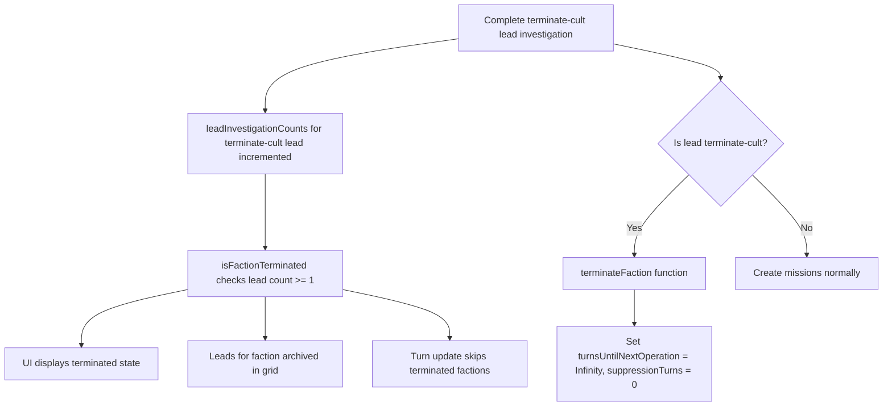

# Faction Elimination Feature

## Overview

Implement the complete faction elimination feature as described in the backlog. When a "Terminate [Faction]" lead investigation completes, the faction should be marked as terminated, leads archived, and counters displayed as "-", while allowing existing missions and investigations to continue naturally.

## Implementation Steps

### 1. **Add Utility Function to Check Terminated Status**

**Files to modify:**

- [`web/src/lib/model_utils/factionUtils.ts`](web/src/lib/model_utils/factionUtils.ts)

**Changes:**

- Create utility function `isFactionTerminated(faction: Faction, leadInvestigationCounts: Record<string, number>): boolean`
- This function checks if the terminate-cult lead for the given faction has been completed at least once
- Lead ID pattern: `lead-{facId}-terminate-cult` where `{facId}` is extracted from `faction.factionDataId`
- Returns true if `leadInvestigationCounts[terminateCultLeadId] >= 1`

**Design decision:** Derive terminated state from existing data (lead investigation counts) rather than storing redundant state on the Faction object. This is cleaner and avoids synchronization issues.

### 2. **Handle Terminate Cult Investigation Completion**

**Files to modify:**

- [`web/src/lib/game_utils/turn_advancement/updateLeadInvestigations.ts`](web/src/lib/game_utils/turn_advancement/updateLeadInvestigations.ts)

**Changes:**

- In `completeInvestigation()` function, after creating missions, check if the completed lead ID matches pattern `lead-{facId}-terminate-cult`
- If it does, extract faction ID from lead ID and call new helper function `terminateFaction(state, factionId)`
- Create helper function `terminateFaction(state: GameState, factionId: FactionId)` that:
- Finds the faction by ID
- Sets `faction.turnsUntilNextOperation = Infinity`
- Sets `faction.suppressionTurns = 0`
- Does NOT modify missions or lead investigations (they continue naturally)
- Note: The terminated state itself is determined by `isFactionTerminated()` checking the lead count, so no flag needs to be set

### 3. **Archive Leads for Terminated Faction**

**Files to modify:**

- [`web/src/components/LeadsDataGrid/LeadsDataGrid.tsx`](web/src/components/LeadsDataGrid/LeadsDataGrid.tsx)
- [`web/src/ai/intellects/basic/leadInvestigation.ts`](web/src/ai/intellects/basic/leadInvestigation.ts)
- [`web/src/lib/model_utils/leadUtils.ts`](web/src/lib/model_utils/leadUtils.ts)

**Changes:**

- In `LeadsDataGrid.tsx`, modify the `isArchived` computation to also check if the lead's faction is terminated:
  ```typescript
        const isArchived = !lead.repeatable && hasDoneInvestigation || 
                           isFactionForLeadTerminated(lead, factions, leadInvestigationCounts)
  ```


- Add utility function in `leadUtils.ts`: `isFactionForLeadTerminated(lead: Lead, factions: Faction[], leadInvestigationCounts: Record<string, number>): boolean`
- This function extracts the faction ID from the lead ID, finds the faction, and calls `isFactionTerminated(faction, leadInvestigationCounts)`
- In AI player logic (`leadInvestigation.ts`), exclude archived leads from `getAvailableLeads()` using the same check

### 4. **Update UI Display for Terminated Factions**

**Files to modify:**

- [`web/src/components/SituationReportCard.tsx`](web/src/components/SituationReportCard.tsx)
- [`web/src/components/TurnReport/formatSituationReport.ts`](web/src/components/TurnReport/formatSituationReport.ts)
- [`web/src/lib/model_utils/factionActivityLevelUtils.ts`](web/src/lib/model_utils/factionActivityLevelUtils.ts)

**Changes in SituationReportCard.tsx:**

- Pass `leadInvestigationCounts` to `getFactionRows()`
- Modify `getFactionRows()` to call `isFactionTerminated(faction, leadInvestigationCounts)`
- When terminated:
- Activity level: display as "Terminated"
- Level progress: display as "-"
- Next operation: display as "-"
- Suppression: display as "-"

**Changes in formatSituationReport.ts:**

- In `formatFactionBreakdown()`, check terminated state using `isFactionTerminated()`
- Show "Terminated" status prominently in turn reports
- Will need to pass `leadInvestigationCounts` through the call chain

**Changes in factionActivityLevelUtils.ts:**

- Create new helper `getEffectiveActivityLevelName(faction: Faction, leadInvestigationCounts: Record<string, number>): string`
- This function calls `isFactionTerminated()` and returns 'Terminated' if true, otherwise returns the normal activity level name

### 5. **Prevent Faction Operations for Terminated Factions**

**Files to modify:**

- [`web/src/lib/game_utils/turn_advancement/evaluateTurn.ts`](web/src/lib/game_utils/turn_advancement/evaluateTurn.ts)

**Changes:**

- In `updateFactions()` function, skip faction operation roll logic for terminated factions
- In loop that processes factions for operations, add early continue:
  ```typescript
        if (isFactionTerminated(faction, state.leadInvestigationCounts)) {
          // Skip operation roll and activity progression for terminated factions
          // Still include in faction reports but with no changes
          continue
        }
  ```


- Terminated factions should still be included in faction reports, but with no changes to their counters

### 6. **Add Tests**

**Files to create/modify:**

- Create [`web/test/unit/factionTermination.test.ts`](web/test/unit/factionTermination.test.ts)
- Modify [`web/test/e2e/App.test.tsx`](web/test/e2e/App.test.tsx)

**Test scenarios:**

- Complete "Terminate cult" investigation → `isFactionTerminated()` returns true
- Terminated faction has correct display values (all show "-")
- Leads for terminated faction are archived
- Active defensive missions from terminated faction can still expire/be completed
- Active lead investigations against terminated faction can still be completed
- Terminated faction does not spawn new operations
- AI player does not start new investigations for archived leads
- Test `isFactionTerminated()` utility function directly

## Data Flow




## Key Design Decisions

1. **Derive terminated state from lead investigation counts:** Instead of storing redundant state on Faction, check if terminate-cult lead has been completed (count >= 1). This is cleaner and avoids synchronization issues.
2. **Keep leads purely computed:** Don't modify lead data, just compute archived state from faction terminated status
3. **Let existing missions/investigations complete naturally:** No special cleanup needed, they expire/complete on their own
4. **Display "-" for all counters:** Clear visual indicator that faction is no longer active
5. **Skip terminated factions in turn updates:** Early continue in faction loop prevents operations and progression
6. **Set counters to safe values in terminateFaction():** While not strictly necessary (since we skip terminated factions), setting turnsUntilNextOperation to Infinity provides defense-in-depth

## Files Summary

**Core Logic:**

- [`web/src/lib/game_utils/turn_advancement/updateLeadInvestigations.ts`](web/src/lib/game_utils/turn_advancement/updateLeadInvestigations.ts) - Detect and terminate faction
- [`web/src/lib/game_utils/turn_advancement/evaluateTurn.ts`](web/src/lib/game_utils/turn_advancement/evaluateTurn.ts) - Skip terminated factions

**UI Display:**

- [`web/src/components/SituationReportCard.tsx`](web/src/components/SituationReportCard.tsx) - Show terminated state
- [`web/src/components/TurnReport/formatSituationReport.ts`](web/src/components/TurnReport/formatSituationReport.ts) - Format turn reports
- [`web/src/components/LeadsDataGrid/LeadsDataGrid.tsx`](web/src/components/LeadsDataGrid/LeadsDataGrid.tsx) - Archive leads

**Utilities:**

- [`web/src/lib/model_utils/factionUtils.ts`](web/src/lib/model_utils/factionUtils.ts) - Add `isFactionTerminated()` helper function
- [`web/src/lib/model_utils/leadUtils.ts`](web/src/lib/model_utils/leadUtils.ts) - Add `isFactionForLeadTerminated()` helper function
- [`web/src/lib/model_utils/factionActivityLevelUtils.ts`](web/src/lib/model_utils/factionActivityLevelUtils.ts) - Add `getEffectiveActivityLevelName()` helper function

**Tests:**

- [`web/src/ai/intellects/basic/leadInvestigation.ts`](web/src/ai/intellects/basic/leadInvestigation.ts) - Update AI to exclude archived leads