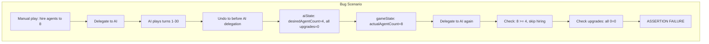

# Fix AI State Invariant Violation After Undo

## Root Cause

The AI state in [`aiStateSlice.ts`](web/src/redux/slices/aiStateSlice.ts) maintains an **invariant**:

- If `actualAgentCount >= desiredAgentCount`, then **exactly one** upgrade must have `desired === actual + 1`

The invariant is enforced in [`purchasing.ts:122-126`](web/src/ai/intellects/basic/purchasing.ts):

```122:126:web/src/ai/intellects/basic/purchasing.ts
  if (foundUpgrade === undefined) {
    const mismatchDetails = mismatches.length > 0 ? ` Mismatches: ${mismatches.join('; ')}` : ''
    throw new Error(
      `AI bug: Expected exactly one desired cap/upgrade to be exactly 1 above actual, but found none.${mismatchDetails}`,
```

**The bug occurs because:**

1. Both `gameState` and `aiState` are inside the `undoable` wrapper in [`rootReducer.ts`](web/src/redux/rootReducer.ts)
2. When the user undoes to a point where manual play happened (before AI delegation), the `aiState` reverts to its initial values:

   - `desiredAgentCount = 4` (initial agents + 1)
   - All `desired*Upgrades = 0`, all `actual*Upgrades = 0`

3. But the `gameState` at that undo point may have more agents (from manual hiring)
4. Result: `actualAgentCount >= desiredAgentCount` (e.g., 8 >= 4), but ALL upgrade desired/actual are equal (0 = 0)
5. The invariant is broken, and the assertion fails


## Solution

Add a **sanity check** at the start of `spendMoney` in [`purchasing.ts`](web/src/ai/intellects/basic/purchasing.ts) that:

1. Checks if the invariant is violated (all desired === actual)
2. If violated, calls `decideSomeDesiredCount` to establish the invariant before proceeding

This is the least invasive fix - it makes the AI self-healing when encountering an invalid state after undo.

## Implementation

Modify [`web/src/ai/intellects/basic/purchasing.ts`](web/src/ai/intellects/basic/purchasing.ts):

```typescript
export function spendMoney(api: PlayTurnAPI): void {
  // Ensure the AI state invariant holds (may be broken after undo)
  ensureInvariant(api)
  
  let priority = computeNextBuyPriority(api)
  // ... rest unchanged
}

function ensureInvariant(api: PlayTurnAPI): void {
  const { gameState, aiState } = api
  const actualAgentCount = notTerminated(gameState.agents).length
  
  // If we haven't met agent goal yet, invariant is satisfied
  if (actualAgentCount < aiState.desiredAgentCount) {
    return
  }
  
  // Check if any upgrade has desired > actual
  const hasUpgradeGoal = 
    aiState.desiredAgentCapUpgrades > aiState.actualAgentCapUpgrades ||
    aiState.desiredTransportCapUpgrades > aiState.actualTransportCapUpgrades ||
    // ... check all upgrade types
    
  if (!hasUpgradeGoal) {
    console.log('spendMoney: invariant violated (likely after undo), re-establishing...')
    decideSomeDesiredCount(api)
  }
}
```
