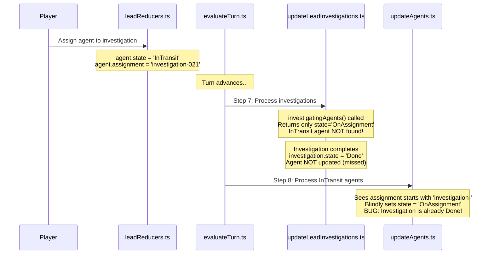

# Fix Agent-Investigation Assignment Race Condition

## Root Cause Analysis

### The Bug

Agents can end up with `state = 'OnAssignment'` and `assignment = 'investigation-XXX'` even when that investigation has `state = 'Done'`. This happens due to a timing issue in turn evaluation.

### Code Flow Diagram




### Example Scenario

1. **Turn 50 (Player Action)**: Agent-043 assigned to investigation-021

- `agent.state = 'InTransit'`
- `agent.assignment = 'investigation-021'`
- `investigation.agentIds = ['agent-043']`

2. **Turn 50 to 51 (evaluateTurn, Step 7)**: `updateLeadInvestigations` runs

- Investigation-021 rolls success and completes
- `investigatingAgents()` is called - but it only returns agents where `state === 'OnAssignment'`
- Agent-043 has `state = 'InTransit'`, so it's **NOT found**
- Investigation marked `Done`, `agentIds = []`, but agent-043's assignment is **NOT reset**

3. **Turn 50 to 51 (evaluateTurn, Step 8)**: `updateInTransitAgents` runs

- Agent-043 has `state = 'InTransit'` and `assignment = 'investigation-021'`
- Code at line 83-85 sees assignment starts with `'investigation-'`
- Agent transitions to `state = 'OnAssignment'`
- **BUG**: Agent is now OnAssignment to a Done investigation!

### Key Code Locations

The filtering function in [`agentUtils.ts`](web/src/lib/model_utils/agentUtils.ts) only finds OnAssignment agents:

```typescript
export function investigatingAgents(agents: Agent[], investigation: LeadInvestigation): Agent[] {
  const filteredAgents = withIds(agents, investigation.agentIds)
  return onAssignmentWithAssignmentId(filteredAgents, investigation.id)  // Only state='OnAssignment'!
}
```

The problematic transition in [`updateAgents.ts`](web/src/lib/game_utils/turn_advancement/updateAgents.ts) lines 83-85:

```typescript
} else if (typeof agent.assignment === 'string' && agent.assignment.startsWith('investigation-')) {
  // Agents assigned to lead investigation transition to OnAssignment
  agent.state = 'OnAssignment'  // No check if investigation is still Active!
}
```

---

## Fix Options

### Option A: Fix in `updateInTransitAgents` (Recommended)

Modify [`updateAgents.ts`](web/src/lib/game_utils/turn_advancement/updateAgents.ts) to check if the investigation is still Active before transitioning the agent:

```typescript
} else if (typeof agent.assignment === 'string' && agent.assignment.startsWith('investigation-')) {
  // Check if investigation is still active before transitioning
  const investigation = state.leadInvestigations[agent.assignment]
  if (investigation?.state === 'Active') {
    agent.state = 'OnAssignment'
  } else {
    // Investigation completed or abandoned while agent was in transit
    agent.state = 'Available'
    agent.assignment = 'Standby'
  }
}
```

**Pros**: Defensive - handles any edge case where investigation state changes while agents are in transit.**Cons**: Requires passing `state` to `updateInTransitAgents` (it already has it).

### Option B: Fix in `completeInvestigation`

Modify [`updateLeadInvestigations.ts`](web/src/lib/game_utils/turn_advancement/updateLeadInvestigations.ts) to also handle InTransit agents:

```typescript
// In completeInvestigation, after updating OnAssignment agents:
// Also handle agents that are InTransit to this investigation
const inTransitAgents = state.agents.filter(
  (agent) => agent.assignment === investigation.id && agent.state === 'InTransit'
)
for (const agent of inTransitAgents) {
  agent.assignment = 'Standby'
  // Keep InTransit - they'll transition to Available next step
}
```

**Pros**: Fixes the issue at the source.**Cons**: Must also update `unassignExhaustedAgents` similarly, and any future code that uses `investigatingAgents`.

### Recommendation

**Option A** is recommended because it's more robust and centralized - it ensures `updateInTransitAgents` always validates the target state before transitioning, preventing similar bugs from other code paths.---

## Assertions to Add

Add a new validation to [`validateAgentInvariants.ts`](web/src/lib/model_utils/validateAgentInvariants.ts) to catch this class of bug:

```typescript
function validateInvestigationAssignment(agent: Agent, state: GameState): void {
  if (!agent.assignment.startsWith('investigation-')) {
    return
  }
  const investigationId = agent.assignment
  const investigation = state.leadInvestigations[investigationId]
  assertDefined(
    investigation,
    `Agent ${agent.id} is assigned to ${investigationId}, but the investigation does not exist`
  )
  
  // If agent is OnAssignment to an investigation, the investigation must be Active
  if (agent.state === 'OnAssignment') {
    assertEqual(
      investigation.state,
      'Active',
      `Agent ${agent.id} is OnAssignment to ${investigationId} but investigation state is ${investigation.state}`
    )
  }
}
```

Call this new function from `validateAgentInvariants`:

```typescript
export function validateAgentInvariants(agent: Agent, state: GameState): void {
  validateAgentLocalInvariants(agent, state)
  validateMissionAssignment(agent, state)
  validateInvestigationAssignment(agent, state)  // Add this
}
```

This assertion would have immediately caught the bug when `validateGameStateInvariants` is called at the start of the next turn.---

## Summary of Changes

| File | Change ||------|--------|