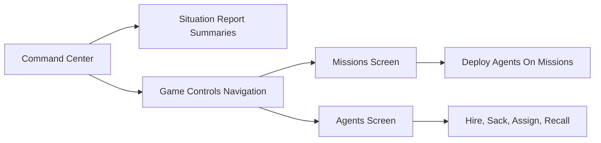

# Missions And Agents UI Specs

## Current Shape

The existing Leads spec at [docs/ui/ui_leads_screen.md](docs/ui/ui_leads_screen.md) is laid out as a player-facing UI contract:

- It starts with the overall screen layout and command-center navigation additions.
- It defines the primary action flow before the grid details.
- It documents each data grid through columns, title text, toolbar filters, row-selection rules, empty states, and detailed column meanings.
- It ends with the compact Situation Report summary and `See also` links to ruleset/design docs.

The current command center renders both `MissionsDataGrid` and `AgentsDataGrid` inline in [web/src/components/App.tsx](web/src/components/App.tsx), while screen-level navigation already exists for Leads and Charts through [web/src/components/GameControls/GameControls.tsx](web/src/components/GameControls/GameControls.tsx). Player actions for hiring, sacking, assigning, recalling, deploying, and investigating are centralized in [web/src/components/GameControls/PlayerActions.tsx](web/src/components/GameControls/PlayerActions.tsx). Situation Report already has a Leads summary in [web/src/components/SituationReportCard.tsx](web/src/components/SituationReportCard.tsx), which is the model for adding compact Missions and Agents summaries.

## Files To Create

Create two new docs, matching the structure and specificity of [docs/ui/ui_leads_screen.md](docs/ui/ui_leads_screen.md):

- [docs/ui/ui_missions_screen.md](docs/ui/ui_missions_screen.md)
- [docs/ui/ui_agents_screen.md](docs/ui/ui_agents_screen.md)

Optionally update [docs/ui/ui_leads_screen.md](docs/ui/ui_leads_screen.md) only if cross-links are useful; otherwise leave the existing Leads spec unchanged.

## Missions Spec Outline

Write [docs/ui/ui_missions_screen.md](docs/ui/ui_missions_screen.md) with these sections:

- `Mission deployments UI (Missions screen)`: intro and table of contents mirroring the Leads spec.
- `Missions Screen layout`: dedicated screen layout with a primary `Missions data grid`, a mission-tailored `Agents data grid for missions`, fixed-width action buttons, `Next turn`, and `Back to command center`.
- `Navigating between command center screen and missions screen`: add a `Missions` button in `Game Controls`; define return behavior.
- `Deploying agents on a mission`: define enablement and labels for the deploy action, including no mission selected, no ready agents selected, non-active mission selected, and successful deployment clearing selections.
- `Missions data grid`: document mission rows currently represented by [web/src/components/MissionsDataGrid/MissionsDataGrid.tsx](web/src/components/MissionsDataGrid/MissionsDataGrid.tsx) and columns from [web/src/components/MissionsDataGrid/getMissionsColumns.tsx](web/src/components/MissionsDataGrid/getMissionsColumns.tsx): checkbox, mission ID/name, CR/threat, state, expiry, details, and archived-only concluded turn.
- `Missions data grid filters toolbar`: specify active/deployed/default rows vs archived rows, preserving the current archived toggle semantics from [web/src/components/MissionsDataGrid/MissionsDataGridToolbar.tsx](web/src/components/MissionsDataGrid/MissionsDataGridToolbar.tsx), or tightening it into Leads-style mutually clear filter chips if desired.
- `Agents data grid for missions`: custom-tailored grid, not the full roster. It should focus on deploy-relevant facts: checkbox, ID, state, assignment, effective skill/combat rating contribution, HP, exhaustion, recovery or unavailable reason.
- `Agents data grid for missions filters toolbar`: define mission-specific filters such as `Ready`, `Away`, `Exhausted`, and `Recovering`, with `Ready` as the default and selection limited to agents eligible for deployment.
- `Mission details`: decide whether the existing detail screen remains reachable from the Missions screen through the `Details` column, reusing behavior from [web/src/components/MissionDetails/MissionDetailsScreen.tsx](web/src/components/MissionDetails/MissionDetailsScreen.tsx).
- `Missions summary in situation report panel`: define compact rows such as `Active missions`, `Deployed missions`, `Expiring soon`, and `Archived outcomes`, using counts grounded in [web/src/components/MissionsDataGrid/missionCounts.ts](web/src/components/MissionsDataGrid/missionCounts.ts).
- `See also`: link to [docs/design/about_deployed_mission_site.md](docs/design/about_deployed_mission_site.md), [docs/design/about_mission_threat_assessment.md](docs/design/about_mission_threat_assessment.md), and [docs/design/about_agents.md](docs/design/about_agents.md).

## Agents Spec Outline

Write [docs/ui/ui_agents_screen.md](docs/ui/ui_agents_screen.md) with these sections:

- `Agent management UI (Agents screen)`: intro and table of contents mirroring the Leads spec.
- `Agents Screen layout`: dedicated full roster screen with `Agents data grid`, action buttons, `Next turn`, and `Back to command center`.
- `Navigating between command center screen and agents screen`: add an `Agents` button in `Game Controls`; define return behavior.
- `Managing agents`: document actions currently in [web/src/components/GameControls/PlayerActions.tsx](web/src/components/GameControls/PlayerActions.tsx): hire, assign to contracting, assign to training, recall, sack, and any selection-clearing behavior.
- `Agents data grid`: document the full roster view currently implemented by [web/src/components/AgentsDataGrid/AgentsDataGrid.tsx](web/src/components/AgentsDataGrid/AgentsDataGrid.tsx) and [web/src/components/AgentsDataGrid/getAgentsColumns.tsx](web/src/components/AgentsDataGrid/getAgentsColumns.tsx).
- `Agents data grid title`: keep count semantics from [web/src/components/AgentsDataGrid/agentCounts.ts](web/src/components/AgentsDataGrid/agentCounts.ts), including active, ready, exhausted, recovering, KIA, and sacked counts.
- `Agents data grid filters toolbar`: define full-agent filters/views for available/ready, recovering, stats, and terminated. Make explicit that the Agents screen is the place to view terminated agents and stats, unlike the Missions and Leads agent sub-grids.
- `Agents data grid column details`: document default columns, recovery columns, stats columns, and terminated columns based on [web/src/components/AgentsDataGrid/AgentsDataGridUtils.ts](web/src/components/AgentsDataGrid/AgentsDataGridUtils.ts).
- `Action button states`: specify disabled labels and selection requirements for contracting, training, recalling, sacking, and hiring. Separate these from mission deployment and lead investigation, which should live on their dedicated screens.
- `Agents summary in situation report panel`: define compact rows such as `Ready agents`, `Recovering agents`, `Away agents`, `KIA`, and `Sacked`, using counts grounded in [web/src/components/AgentsDataGrid/agentCounts.ts](web/src/components/AgentsDataGrid/agentCounts.ts).
- `See also`: link to [docs/design/about_agents.md](docs/design/about_agents.md), [docs/design/about_deployed_mission_site.md](docs/design/about_deployed_mission_site.md), and [docs/design/about_lead_investigations.md](docs/design/about_lead_investigations.md).

## Boundaries And Decisions To Capture

The specs should explicitly capture these product decisions so implementation later has a clear target:

- Command Center should no longer render `MissionsDataGrid` or `AgentsDataGrid`; it should keep compact summaries in Situation Report and navigation buttons in Game Controls.
- Missions screen owns mission deployment and its mission-specific agent picker.
- Agents screen owns full roster inspection and roster-management actions: contracting, training, recalling, sacking, and hiring.
- Leads screen keeps its existing lead-specific agent picker and lead-investigation action.
- Each dedicated screen should tailor the agent grid to the task instead of sharing every full-roster column by default.

## Verification For The Doc Change

After writing the docs, run the project’s light documentation/code-quality check appropriate for a doc-only change. If only Markdown files changed, inspect rendered Markdown structure and run `oxlint` only if code was touched; reserve `qcheck` for later implementation changes.
