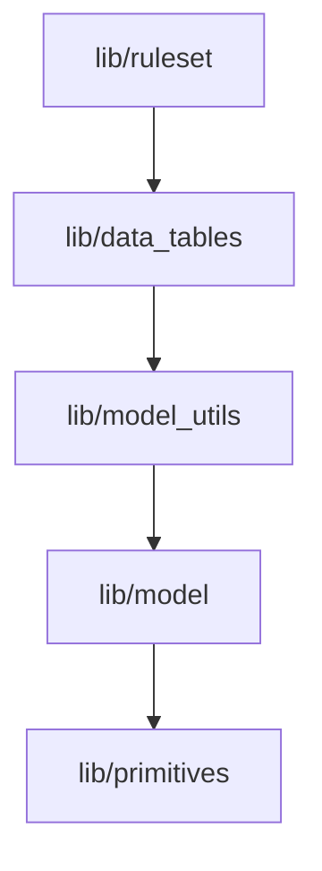

# Move data_table_utils to model_utils and update dependencies

## Overview

Refactor the dependency structure by moving utility functions from `data_table_utils` to `model_utils`, eliminating the `data_table_utils` directory, and updating the dependency chain to: `ruleset -> data_tables -> model_utils -> model`.

## Current State

- `data_table_utils/` contains:
- `getterUtils.ts` - Functions that query data tables (e.g., `getFactionDataById`, `getMissionDataById`)
- `formatUtils.ts` - Formatting functions (e.g., `fmtAgentId`, `fmtForDisplay`, `f6str`)
- Current dependency chain: `ruleset -> data_table_utils -> data_tables -> model_utils -> model`
- About 30 files import from `data_table_utils`

## Changes Required

### 1. Move files to model_utils

- Move `web/src/lib/data_table_utils/getterUtils.ts` → `web/src/lib/model_utils/getterUtils.ts`
- Move `web/src/lib/data_table_utils/formatUtils.ts` → `web/src/lib/model_utils/formatUtils.ts`
- Update internal imports in `formatUtils.ts` (it imports from `./getterUtils` which will remain valid)

### 2. Update all import statements

Update imports in ~30 files from `../data_table_utils/getterUtils` or `../data_table_utils/formatUtils` to `../model_utils/getterUtils` or `../model_utils/formatUtils`:**Files importing from getterUtils:**

- `web/src/lib/ruleset/factionActivityLevelRuleset.ts`
- `web/src/components/SituationReportCard.tsx`
- `web/src/lib/game_utils/turn_advancement/evaluateDeployedMission.ts`
- `web/src/components/LeadInvestigationsDataGrid/LeadInvestigationsDataGrid.tsx`
- `web/src/lib/factories/missionFactory.ts`
- `web/src/redux/reducers/leadReducers.ts`
- `web/src/components/MissionDetails/MissionDetailsCard.tsx`
- `web/src/redux/eventsMiddleware.ts`
- `web/src/components/GameControls/PlayerActions.tsx`
- `web/src/lib/factories/enemyFactory.ts`
- `web/src/lib/ruleset/factionRuleset.ts`
- `web/src/lib/game_utils/turn_advancement/evaluateTurn.ts`
- `web/src/components/MissionsDataGrid/MissionsDataGrid.tsx`
- `web/src/lib/ruleset/factionOperationLevelRuleset.ts`
- `web/src/lib/game_utils/turn_advancement/updateLeadInvestigations.ts`

**Files importing from formatUtils:**

- `web/src/components/TurnReport/formatSituationReport.ts`
- `web/src/lib/factories/agentFactory.ts`
- `web/src/lib/factories/leadInvestigationFactory.ts`
- `web/src/components/LeadInvestigationsDataGrid/LeadInvestigationsDataGrid.tsx`
- `web/src/redux/eventsMiddleware.ts`
- `web/src/components/AgentsDataGrid/getAgentsColumns.tsx`
- `web/src/components/LeadInvestigationsDataGrid/getLeadInvestigationsColumns.tsx`
- `web/src/components/MissionsDataGrid/getMissionsColumns.tsx`
- `web/src/components/LeadsDataGrid/getLeadsColumns.tsx`
- `web/src/components/Common/MyChip.tsx`
- `web/src/components/EventLog.tsx`
- `web/src/components/GameControls/PlayerActions.tsx`
- `web/src/components/TurnReport/formatAssets.ts`
- `web/src/lib/factories/enemyFactory.ts`

### 3. Delete data_table_utils directory

- Remove `web/src/lib/data_table_utils/` directory after all imports are updated

### 4. Update dependency diagram

Update `docs/design/about_code_dependencies.md`:

- Remove `LibDataTUtils[lib/data_table_utils]` node from the diagram
- Remove `LibRul --> LibDataTUtils` edge
- Remove `LibDataTUtils --> LibDataT` edge
- Add `LibRul --> LibDataT` edge (ruleset depends on data_tables)
- Ensure chain: `LibRul --> LibDataT --> LibMUt --> LibMod --> LibPri`

## New Dependency Chain

## Verification

After changes:

- All imports should reference `model_utils` instead of `data_table_utils`