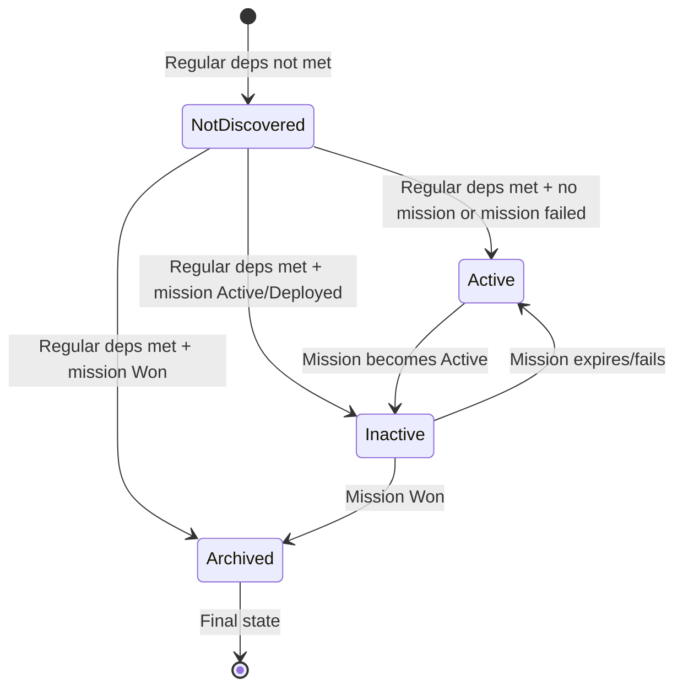

# Support Negated Dependencies (`!`) for Leads

This feature adds support for `!` prefix in lead dependencies to create "NOT" conditions, introducing a new "inactive" lead state.

## Overview

When a lead has a dependency like `!missiondata-raid-{facId}-hq`, the lead will:

- Be **active** only when no matching mission exists or missions are in terminal non-success states (Retreated, Wiped, Expired)
- Be **inactive** when the mission is Active or Deployed (player is doing the mission)
- Be **archived** when the mission is Won

---

## Key Files to Modify

1. **[`web/src/components/LeadsDataGrid/LeadsDataGrid.tsx`](web/src/components/LeadsDataGrid/LeadsDataGrid.tsx)** - Update discovery logic and filtering
2. **[`web/src/components/LeadsDataGrid/LeadsDataGridToolbar.tsx`](web/src/components/LeadsDataGrid/LeadsDataGridToolbar.tsx)** - Add "inactive" checkbox (radio-like behavior)
3. **[`web/src/components/LeadsDataGrid/getLeadsColumns.tsx`](web/src/components/LeadsDataGrid/getLeadsColumns.tsx)** - Add `isInactive` to `LeadRow` type
4. **[`web/src/components/LeadsDataGrid/leadCounts.ts`](web/src/components/LeadsDataGrid/leadCounts.ts)** - Add inactive count
5. **[`web/src/components/LeadsDataGrid/LeadsDataGridTitle.tsx`](web/src/components/LeadsDataGrid/LeadsDataGridTitle.tsx)** - Display inactive count
6. **[`web/src/lib/model_utils/leadUtils.ts`](web/src/lib/model_utils/leadUtils.ts)** - Add helper functions for negated dependency logic
7. **[`docs/about_lead_discovery.md`](docs/about_lead_discovery.md)** - Documentation file with state flow diagram (already created)

---

## Implementation Details

### 1. Add Negated Dependency Helper Functions (`leadUtils.ts`)

```typescript
type NegatedDepStatus = 'active' | 'inactive' | 'archived'

function parseNegatedDependencies(dependsOn: string[]): { regular: string[]; negated: string[] }

function getNegatedDepStatus(negatedDeps: string[], missions: Mission[]): NegatedDepStatus
```

- Parse `!` prefix from dependencies
- Check mission states: Won = archived, Active/Deployed = inactive, otherwise active

### 2. Update Lead Discovery and State Logic (`LeadsDataGrid.tsx`)

Current discovery logic checks if all dependencies are met. New logic:

- Regular dependencies: check `leadInvestigationCounts` or `wonMissionDataIds`
- Negated dependencies: determine lead state (active/inactive/archived)

### 3. Update LeadRow Type (`getLeadsColumns.tsx`)

Add `isInactive: boolean` field alongside existing `isArchived`.

### 4. Update Toolbar (`LeadsDataGridToolbar.tsx`)

Change from two independent checkboxes to radio-like single-filter:

- `'active' | 'inactive' | 'archived'` filter type
- Add "inactive" checkbox to the left of "archived"
- Only one can be selected at a time (clicking one unchecks others)

### 5. Update Lead Counts (`leadCounts.ts`, `LeadsDataGridTitle.tsx`)

Add `inactive: number` to `LeadCounts` type and display in title.

---

## State Flow Diagram


