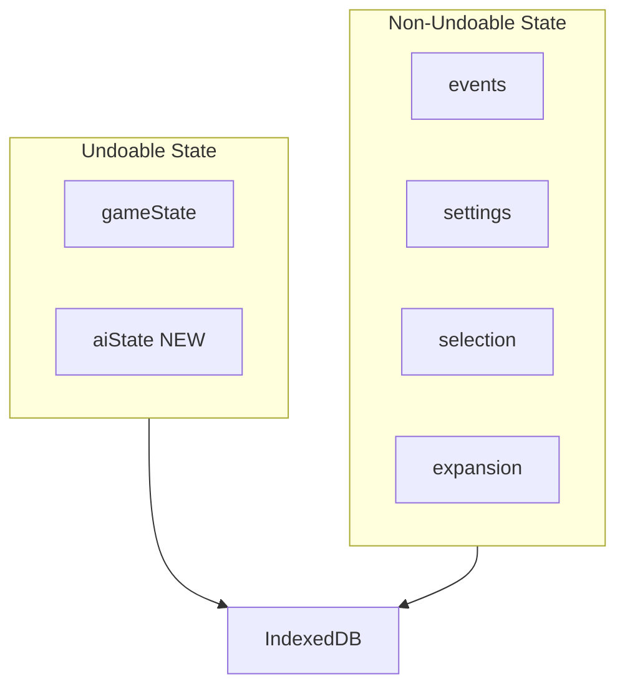

# Persist basicIntellectState in Redux (undoable)

## Overview

Move `basicIntellectState` from a module-level variable into Redux state within the undoable wrapper, so it persists to IndexedDB and correctly reverts on undo/redo.

## Architecture

## Implementation

### 1. Create new AI state slice

Create [`web/src/redux/slices/aiStateSlice.ts`](web/src/redux/slices/aiStateSlice.ts) with:

- `BasicIntellectState` type (moved from `basicIntellect.ts`)
- Initial state using `createInitialState()` logic
- Reducers for updating desired/actual counts
- Export selectors

### 2. Add to undoable reducer

In [`web/src/redux/rootReducer.ts`](web/src/redux/rootReducer.ts):

- Import `aiStateReducer`
- Add to `combinedReducer` alongside `gameState`

### 3. Refactor basicIntellect.ts

In [`web/src/ai/intellects/basicIntellect.ts`](web/src/ai/intellects/basicIntellect.ts):

- Remove module-level `basicIntellectState` variable
- Remove `BasicIntellectState` type (now in slice)
- Update `playTurn` to accept/use state from Redux
- Update all mutations to dispatch Redux actions instead of direct mutation
- Remove `resetBasicIntellectState()` export (reset handled by Redux slice)

### 4. Update integration points

- [`web/src/ai/delegateTurnToAIPlayer.ts`](web/src/ai/delegateTurnToAIPlayer.ts): Pass AI state to intellect
- [`web/src/components/GameControls/ResetControls.tsx`](web/src/components/GameControls/ResetControls.tsx): Remove `resetBasicIntellectState()` call (Redux reset handles it)
- [`web/src/components/utils/appInitChecks.ts`](web/src/components/utils/appInitChecks.ts): Remove `resetBasicIntellectState()` call

### 5. Bump state version

In [`web/src/redux/persist.ts`](web/src/redux/persist.ts):

- Increment `STATE_VERSION` to invalidate old persisted state without new `aiState`

## Key Design Decisions