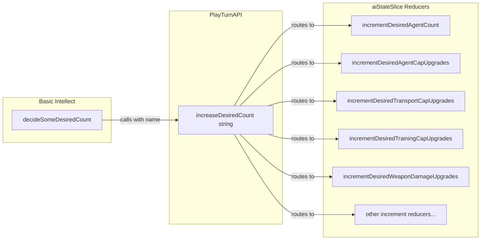

# Refactor Decision-Making Logic for Desired Counts

## Overview

Move nontrivial decision-making from `aiStateSlice.ts` reducers to the basic intellect (`purchasing.ts`), with PlayTurnAPI serving as a routing layer to simple increment reducers.

## Architecture

## Changes

### 1. [`web/src/redux/slices/aiStateSlice.ts`](web/src/redux/slices/aiStateSlice.ts)

- **Remove**: `increaseDesiredCounts` reducer and `increaseSomeDesiredCount`, `increaseDesiredAgentCount` helper functions
- **Add** 8 simple increment reducers (no validation, just +1):
- `incrementDesiredAgentCount`
- `incrementDesiredAgentCapUpgrades`
- `incrementDesiredTransportCapUpgrades`
- `incrementDesiredTrainingCapUpgrades`
- `incrementDesiredWeaponDamageUpgrades`
- `incrementDesiredTrainingSkillGainUpgrades`
- `incrementDesiredExhaustionRecoveryUpgrades`
- `incrementDesiredHitPointsRecoveryUpgrades`
- **Modify** `createInitialState()`: directly set `desiredAgentCount` to `initialGameState.agents.length + 1` instead of calling `increaseSomeDesiredCount`
- **Export** new type `DesiredCountName` for the string union

### 2. [`web/src/lib/model_utils/playTurnApiTypes.ts`](web/src/lib/model_utils/playTurnApiTypes.ts)

- **Replace** `increaseDesiredCounts(): void` with `increaseDesiredCount(name: DesiredCountName): void`

### 3. [`web/src/redux/playTurnApi.ts`](web/src/redux/playTurnApi.ts)

- **Replace** `increaseDesiredCounts()` method with `increaseDesiredCount(name: DesiredCountName)` that routes to the appropriate reducer via switch statement

### 4. [`web/src/ai/intellects/basic/purchasing.ts`](web/src/ai/intellects/basic/purchasing.ts)

- **Add** new function `decideSomeDesiredCount(api: PlayTurnAPI): void` containing all the decision logic currently in `increaseSomeDesiredCount`