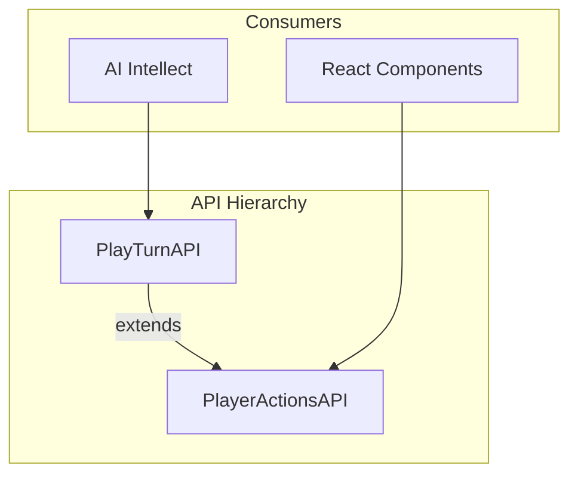

# Split API into PlayerActionsAPI and PlayTurnAPI

## Overview

Create a two-tier API structure where `PlayerActionsAPI` provides validated action wrappers for React components, and `PlayTurnAPI` extends it with state access for the AI intellect.

## API Structure

### PlayerActionsAPI

- Validated wrappers for dispatching player actions
- Used by React components (`PlayerActions.tsx`)
- No state properties - components use `useAppSelector` for state

### PlayTurnAPI

- Extends `PlayerActionsAPI`
- Adds `gameState` and `aiState` properties (auto-refreshed after each action)
- Adds AI state mutation methods (for tracking upgrade counts, desired counts)
- Used by `basicIntellect.ts`

## Implementation

### 1. Create PlayerActionsAPI types

In [`web/src/lib/model_utils/playerActionsApiTypes.ts`](web/src/lib/model_utils/playerActionsApiTypes.ts) (new file):

- Move `ActionResult` type here
- Define `PlayerActionsAPI` with just the action methods (no state)

### 2. Update PlayTurnAPI types

In [`web/src/lib/model_utils/playTurnApiTypes.ts`](web/src/lib/model_utils/playTurnApiTypes.ts):

- Import and extend `PlayerActionsAPI`
- Add `gameState: GameState` property
- Add `aiState: BasicIntellectState` property  
- Add AI state mutation methods: `incrementActualWeaponDamageUpgrades()`, `incrementActualTrainingSkillGainUpgrades()`, `incrementActualExhaustionRecoveryUpgrades()`, `incrementActualHitPointsRecoveryUpgrades()`, `increaseDesiredCounts()`

### 3. Split playTurnApi.ts into two factory functions

In [`web/src/redux/playTurnApi.ts`](web/src/redux/playTurnApi.ts):

- Create `getPlayerActionsApi(): PlayerActionsAPI` - returns just the action wrappers
- Rename/update `getPlayTurnApi(): PlayTurnAPI` - extends PlayerActionsAPI with state and AI methods

### 4. Update PlayerActions.tsx

In [`web/src/components/GameControls/PlayerActions.tsx`](web/src/components/GameControls/PlayerActions.tsx):

- Import `getPlayerActionsApi` instead of `getPlayTurnApi`
- Remove `React.useMemo` wrapper (React Compiler handles this)
- Use `const api = getPlayerActionsApi()`

### 5. Refactor basicIntellect.ts

In [`web/src/ai/intellects/basicIntellect.ts`](web/src/ai/intellects/basicIntellect.ts):

- Remove `import { store }`
- Remove `getAiState()` function - use `api.aiState` instead
- Replace `store.dispatch(incrementActual...)` with `api.incrementActual...()`
- Replace `store.dispatch(increaseDesiredCounts())` with `api.increaseDesiredCounts()`