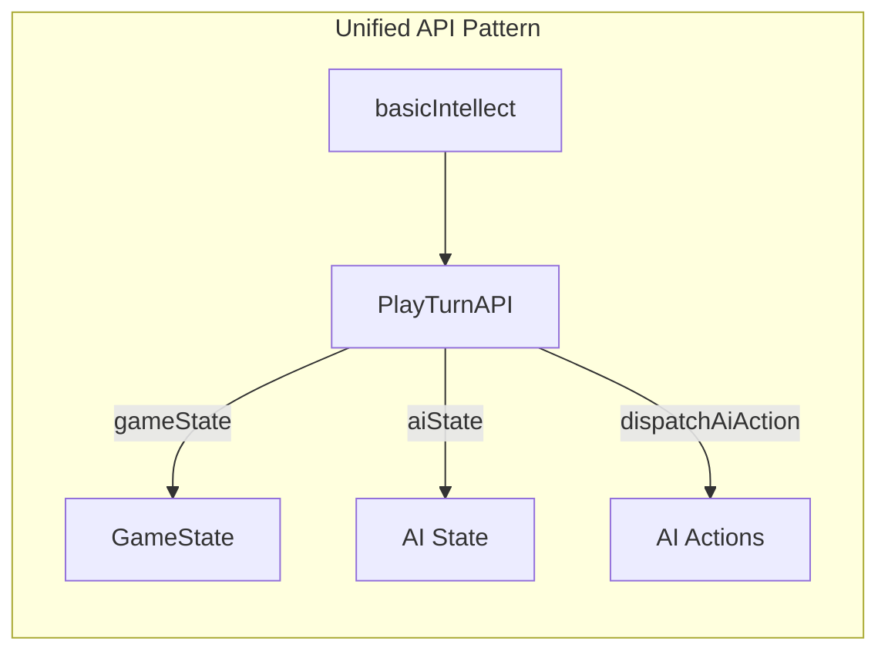

# Unify basicIntellect State Access Through PlayTurnAPI

## Overview

Extend `PlayTurnAPI` to include AI state access and actions, removing direct store imports from `basicIntellect.ts` and creating a consistent API-based pattern for all state management.

## Current Problem

````mermaid
flowchart LR
    subgraph inconsistent [Current Inconsistent Pattern]
        BI[basicIntellect]
        BI -->|api.gameState| GS[GameState]
        BI -->|store.getState| AS1[AI State read]
        BI -->|store.dispatch| AS2[AI State write]
    end
```


## Proposed Solution




## Implementation

### 1. Extend PlayTurnAPI types

In [`web/src/lib/model_utils/playTurnApiTypes.ts`](web/src/lib/model_utils/playTurnApiTypes.ts):

- Add `aiState: BasicIntellectState` property
- Add methods for AI state actions: `incrementActualWeaponDamageUpgrades()`, `incrementActualTrainingSkillGainUpgrades()`, etc.
- Add `increaseDesiredCounts()` method

### 2. Update playTurnApi.ts implementation

In [`web/src/redux/playTurnApi.ts`](web/src/redux/playTurnApi.ts):

- Add `aiState` property that reads from store
- Implement the new AI state action methods
- Add `updateAiState()` helper alongside `updateGameState()`

### 3. Refactor basicIntellect.ts

In [`web/src/ai/intellects/basicIntellect.ts`](web/src/ai/intellects/basicIntellect.ts):

- Remove `import { store }` 
- Remove `getAiState()` function - use `api.aiState` instead
- Replace all `store.dispatch(incrementActual...)` calls with `api.incrementActual...()`
- Replace `store.dispatch(increaseDesiredCounts())` with `api.increaseDesiredCounts()`

### 4. Remove unnecessary useMemo

In [`web/src/components/GameControls/PlayerActions.tsx`](web/src/components/GameControls/PlayerActions.tsx):

- Remove `React.useMemo` wrapper around `getPlayTurnApi()` - React Compiler handles this

## Result

- All state access unified through the API

````