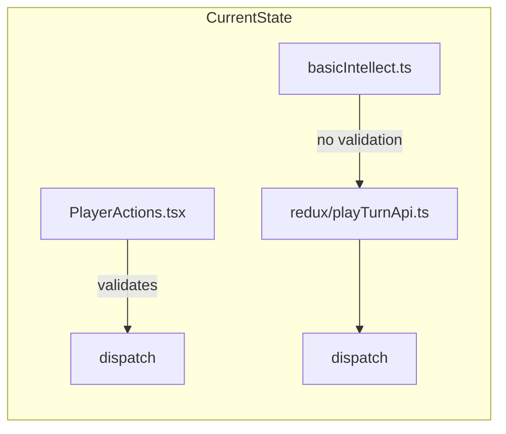
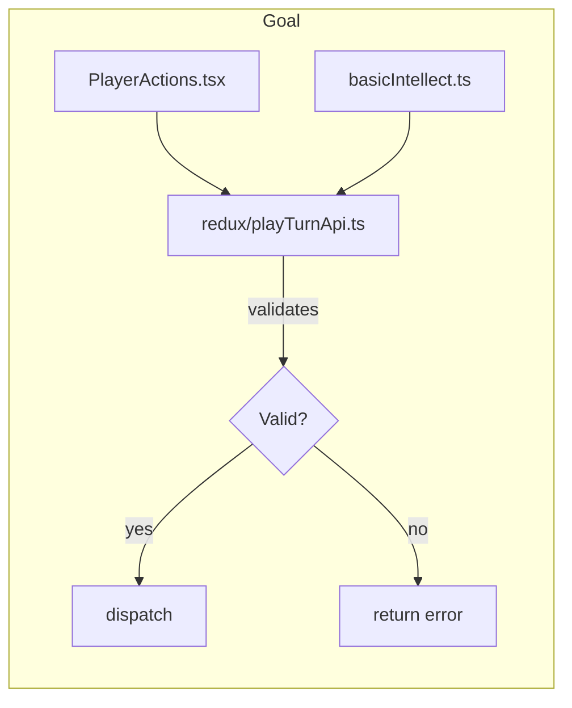

# Move Validation Logic into PlayTurnAPI

## Problem

Currently, validation for player actions is split:

- **UI layer** (`PlayerActions.tsx`): Validates before dispatching Redux actions
- **AI layer** (`basicIntellect.ts`): Calls `PlayTurnAPI` which bypasses validation entirely
- **Reducers**: Trust input blindly, no validation

This allows the AI player to perform invalid actions (e.g., deploying recovering/exhausted agents to missions).

## Solution

Make `redux/playTurnApi.ts` the canonical validation layer:





## Key Design Decisions

1. **API methods return results**: Each method returns `{ success: true }` or `{ success: false, errorMessage: string }`
2. **Validation functions stay in `lib/model_utils/`**: They're pure functions without Redux dependencies
3. **UI handles selection clearing**: `PlayerActions.tsx` continues to manage UI-specific state (clearing selections after success)

## Files to Modify

### 1. [web/src/lib/model_utils/playTurnApiTypes.ts](web/src/lib/model_utils/playTurnApiTypes.ts)

Update `PlayTurnAPI` type to return validation results:

```typescript
export type ActionResult =
  | { success: true }
  | { success: false; errorMessage: string }

export type PlayTurnAPI = {
  gameState: GameState
  hireAgent(): ActionResult
  sackAgents(agentIds: string[]): ActionResult
  // ... etc
}
```

### 2. Create `web/src/lib/model_utils/validatePlayerActions.ts`

Consolidate all validation logic into pure functions. Move/extract from `PlayerActions.tsx`:

- `validateHireAgent(gameState)` - checks money and agent cap
- `validateAssignToContracting(gameState, agentIds)` - checks available + not exhausted
- `validateAssignToTraining(gameState, agentIds)` - checks available + not exhausted + training cap
- `validateDeployAgents(gameState, missionId, agentIds)` - checks available + not exhausted + transport cap + mission state
- `validateBuyUpgrade(gameState, upgradeName)` - checks money
- etc.

### 3. [web/src/redux/playTurnApi.ts](web/src/redux/playTurnApi.ts)

Add validation before each dispatch:

```typescript
hireAgent(): ActionResult {
  const validation = validateHireAgent(api.gameState)
  if (!validation.isValid) {
    return { success: false, errorMessage: validation.errorMessage }
  }
  store.dispatch(hireAgent())
  updateGameState()
  return { success: true }
}
```

### 4. [web/src/components/GameControls/PlayerActions.tsx](web/src/components/GameControls/PlayerActions.tsx)

Refactor to use `PlayTurnAPI` instead of direct dispatch:

```typescript
function handleHireAgent(): void {
  const result = api.hireAgent()
  if (!result.success) {
    setAlertMessage(result.errorMessage)
    setShowAlert(true)
    return
  }
  setShowAlert(false)
}
```

### 5. [web/src/components/GameControls/handleInvestigateLead.ts](web/src/components/GameControls/handleInvestigateLead.ts)

Refactor to use `PlayTurnAPI` for lead investigation actions.

## File Locations (Already Completed)

The following file reorganization has been completed as a prerequisite:

- `playTurnApi.ts` moved from `ai/` to `redux/` directory
- `PlayTurnAPI` type moved to `lib/model_utils/playTurnApiTypes.ts`
- `ai/types.ts` now only contains `AIPlayerIntellect` (no re-exports)
- `about_code_dependencies.md` updated with new dependency edges

## Dependency Compliance

Per [about_code_dependencies.md](docs/design/about_code_dependencies.md):

- `playTurnApi.ts` is in `redux/` directory (can depend on redux store and slices)
- `PlayTurnAPI` type is in `lib/model_utils/playTurnApiTypes.ts` (can import from `lib/data_tables/` and `lib/model/`)
- `Comp__ --> RdxPlayTurnApi` allows `PlayerActions.tsx` to import from `redux/playTurnApi.ts`
- `Ai --> RdxPlayTurnApi` allows AI intellects to import from `redux/playTurnApi.ts`
- `RdxPlayTurnApi --> RdxStore` and `RdxPlayTurnApi --> RdxSli` allow dispatching actions
