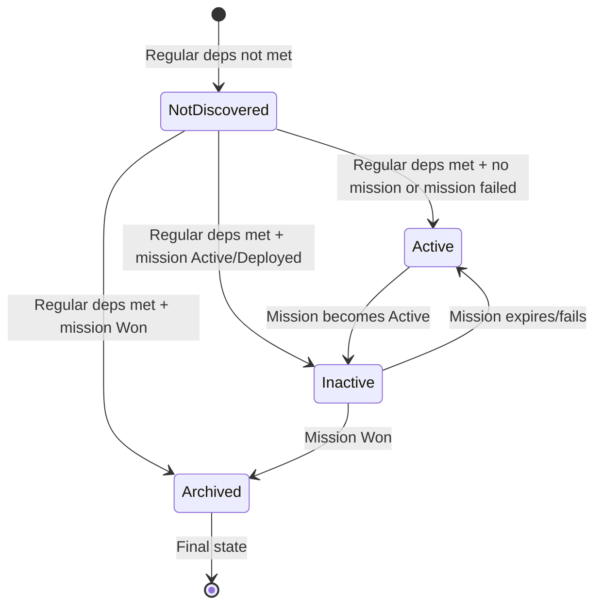

# About Lead Discovery

This document explains how leads are discovered and how their states (active, inactive, archived) are determined based on dependencies.

## Overview

Leads are discovered when their dependencies are met. Once discovered, leads can be in one of three states:

- **Active**: The lead can be investigated
- **Inactive**: The lead was discovered but is temporarily unavailable due to negated dependencies
- **Archived**: The lead is permanently completed or no longer relevant

## Dependency Types

### Regular Dependencies

Regular dependencies specify prerequisites that must be completed before a lead can be discovered. These are checked against:

- `leadInvestigationCounts`: Number of times a lead has been successfully investigated
- `wonMissionDataIds`: Set of mission data IDs for missions that have been won

A lead with regular dependencies like `['lead-criminal-orgs', 'missiondata-raid-red-dawn-safehouse']` will only be discovered when:
- `lead-criminal-orgs` has been investigated at least once (`leadInvestigationCounts['lead-criminal-orgs'] > 0`)
- OR `missiondata-raid-red-dawn-safehouse` has been won (`wonMissionDataIds.has('missiondata-raid-red-dawn-safehouse')`)

### Negated Dependencies (`!`)

Negated dependencies use the `!` prefix to specify conditions that must NOT be true for the lead to remain active. This creates a "NOT" condition.

A dependency like `'!missiondata-raid-{facId}-hq'` means:
- The lead can be **active** only if the mission was never completed successfully AND there is no such mission currently active
- The lead becomes **inactive** if the mission is Active or Deployed
- The lead becomes **archived** if the mission is Won

## Lead States

### Active

A lead is active when:
- All regular dependencies are met (lead is discovered)
- All negated dependencies are satisfied (no blocking missions are active or won)

Active leads can be investigated by assigning agents to them.

### Inactive

A lead becomes inactive when:
- The lead has been discovered (regular dependencies met)
- A negated dependency mission is currently Active or Deployed

Inactive leads cannot be investigated. They will automatically reactivate if the blocking mission expires or fails.

### Archived

A lead becomes archived when:
- It's a non-repeatable lead that has been successfully investigated (`state === 'Done'`)
- The faction associated with the lead has been terminated
- A negated dependency mission has been Won

Archived leads are permanently unavailable for investigation.

## State Flow

The following diagram shows how leads transition between states:



## Example: HQ Lead with Negated Dependency

The `lead-{facId}-hq` lead has dependencies:
```typescript
['lead-{facId}-interrogate-high-commander', '!missiondata-raid-{facId}-hq']
```

**Discovery:**
- The lead is discovered when `lead-{facId}-interrogate-high-commander` is completed
- At discovery, if `missiondata-raid-{facId}-hq` doesn't exist or is in a terminal non-success state, the lead becomes **active**

**State Transitions:**
1. When the player successfully investigates the HQ lead, the "Raid HQ" mission appears
2. The lead immediately becomes **inactive** (mission is Active)
3. If the mission expires or the player fails it, the lead reactivates to **active**
4. If the player succeeds in the mission, the lead becomes **archived**

This ensures that once a player successfully investigates the HQ lead, they must complete the raid mission before they can investigate the HQ lead again (if it's repeatable).

## Implementation Notes

- Negated dependencies are parsed by checking for the `!` prefix
- Mission states are checked against the `missions` array in game state
- Lead state is recalculated each turn during turn advancement

- The UI displays separate counts for active, inactive, and archived leads
