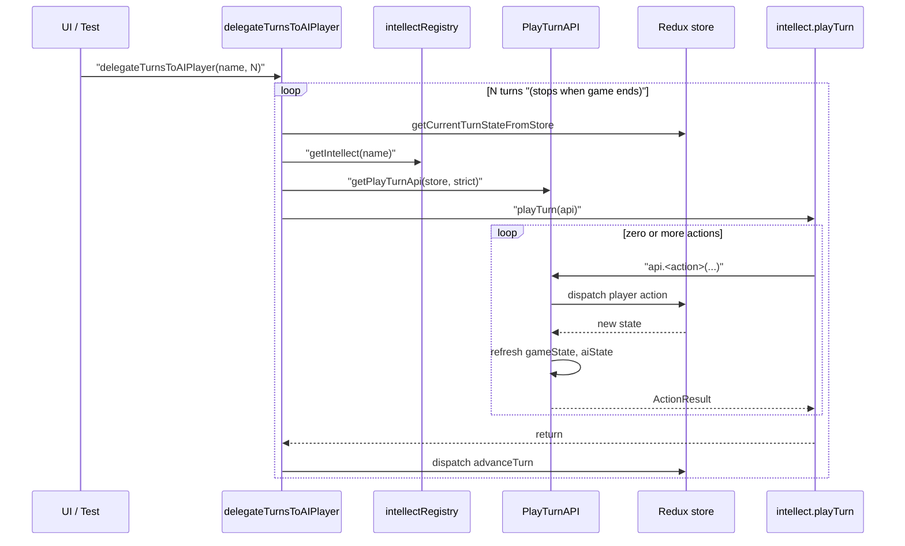

# About AI player intellect

This document is a generic implementation guide for AI player intellects. It describes
what interfaces an intellect has available and how control flow passes between the
game engine and the intellect. It is intentionally independent of any specific
intellect strategy; for the concrete reference implementation, see
[about_basic_intellect.md](about_basic_intellect.md).

- [About AI player intellect](#about-ai-player-intellect)
- [What is an intellect?](#what-is-an-intellect)
- [The `AIPlayerIntellect` contract](#the-aiplayerintellect-contract)
- [Registering a new intellect](#registering-a-new-intellect)
- [The `PlayTurnAPI` interface](#the-playturnapi-interface)
  - [State snapshots](#state-snapshots)
  - [Player actions](#player-actions)
  - [`ActionResult` and fail-fast semantics](#actionresult-and-fail-fast-semantics)
- [Control flow between engine and intellect](#control-flow-between-engine-and-intellect)
  - [Entry points](#entry-points)
  - [Per-turn sequence](#per-turn-sequence)
  - [Sequence diagram](#sequence-diagram)
- [Invariants and rules for intellect authors](#invariants-and-rules-for-intellect-authors)
- [How to author a new intellect](#how-to-author-a-new-intellect)
- [Out of scope](#out-of-scope)
- [See also](#see-also)

# What is an intellect?

An intellect is a pluggable strategy object that plays one or more turns on behalf
of the player. Each intellect is registered by string name in
[web/src/ai/intellectRegistry.ts](../../web/src/ai/intellectRegistry.ts) and selected
by the UI or by a test. The game engine hands the intellect an API object at the
start of every turn and lets the intellect issue player actions until it returns.

Two reference implementations ship today:

- `doNothingIntellect` in [web/src/ai/intellects/doNothingIntellect.ts](../../web/src/ai/intellects/doNothingIntellect.ts) —
  the minimal "no-op" intellect, useful as a template and for tests that want to
  advance turns without any player actions.
- `basicIntellect` in [web/src/ai/intellects/basic/basicIntellect.ts](../../web/src/ai/intellects/basic/basicIntellect.ts) —
  the reference strategy described in [about_basic_intellect.md](about_basic_intellect.md).

# The `AIPlayerIntellect` contract

Every intellect is an object matching the `AIPlayerIntellect` type defined in
[web/src/ai/types.ts](../../web/src/ai/types.ts):

```ts
export type AIPlayerIntellect = {
  name: string
  playTurn(api: PlayTurnAPI): void
}
```

Key properties of `playTurn`:

- It is synchronous. The engine invokes it on the call stack and expects it to
  return before turn advancement can happen.
- It runs inside a single turn. The intellect must not attempt to advance the
  turn itself.
- It must perform every state mutation through `api`. Reading or writing the
  Redux store directly bypasses the safety nets and invariants documented below.
- It returns `void`. Outcomes are observed through the mutated `api.gameState`
  and through each action's `ActionResult`.

# Registering a new intellect

Intellects are exposed to the rest of the app through a registry map in
[web/src/ai/intellectRegistry.ts](../../web/src/ai/intellectRegistry.ts):

- `getIntellect(name)` returns the registered intellect or throws if the name is
  unknown.
- `getAllIntellectNames()` returns every registered name; the UI uses this to
  populate the intellect selector.

To register a new intellect, add a key/value entry to the `intellects` map in
that file. The key becomes the name used by the UI and by tests.

# The `PlayTurnAPI` interface

The `PlayTurnAPI` is the intellect's only input/output surface. Its type is
defined in [web/src/lib/model_utils/playTurnApiTypes.ts](../../web/src/lib/model_utils/playTurnApiTypes.ts),
and its concrete implementation lives in
[web/src/redux/playTurnApi.ts](../../web/src/redux/playTurnApi.ts).

```ts
export type PlayTurnAPI = {
  gameState: GameState
  aiState: BasicIntellectState
  updateCachedGameState(): void
  hireAgent(): ActionResult
  sackAgents(agentIds: AgentId[]): ActionResult
  assignAgentsToContracting(agentIds: AgentId[]): ActionResult
  assignAgentsToTraining(agentIds: AgentId[]): ActionResult
  recallAgents(agentIds: AgentId[]): ActionResult
  startLeadInvestigation(params: { leadId: LeadId; agentIds: AgentId[] }): ActionResult
  addAgentsToInvestigation(params: { investigationId: LeadInvestigationId; agentIds: AgentId[] }): ActionResult
  deployAgentsToMission(params: { missionId: MissionId; agentIds: AgentId[] }): ActionResult
  buyUpgrade(upgradeName: UpgradeName): ActionResult
}
```

The surface splits into two categories: read-only state snapshots and player
actions.

## State snapshots

- `gameState: GameState` is a snapshot of the current turn's game state, taken
  from the Redux store when the API was constructed and refreshed after every
  successful action.
- `aiState: BasicIntellectState` holds intellect-specific bookkeeping (for
  example, tallies of purchased upgrades). The field is named after the
  reference intellect, but it is the single slot available for any intellect
  that needs persistent state across turns.
- `updateCachedGameState()` forces a refresh of the cached snapshots from the
  store. Every successful action already triggers this refresh internally, so
  callers only need this escape hatch when they have reason to believe the
  store changed outside the action surface.

## Player actions

Each action method dispatches the corresponding player action to the Redux store
and, on success, replaces `gameState` and `aiState` with freshly read snapshots.
The available actions are:

- `hireAgent()` and `sackAgents(agentIds)` — manage the roster.
- `assignAgentsToContracting(agentIds)`, `assignAgentsToTraining(agentIds)`, and
  `recallAgents(agentIds)` — move agents between base assignments.
- `startLeadInvestigation({ leadId, agentIds })` and
  `addAgentsToInvestigation({ investigationId, agentIds })` — start or expand
  lead investigations.
- `deployAgentsToMission({ missionId, agentIds })` — deploy agents to a mission.
- `buyUpgrade(upgradeName)` — spend money on an upgrade (including the special
  cap upgrades).

The underlying shapes match `PlayerActionsAPI` in
[web/src/lib/model_utils/playerActionsApiTypes.ts](../../web/src/lib/model_utils/playerActionsApiTypes.ts);
the `PlayTurnAPI` wraps them so the intellect does not have to thread the
current `gameState` into every call.

## `ActionResult` and fail-fast semantics

Every action returns an `ActionResult`:

```ts
export type ActionResult =
  | Readonly<{ success: true }>
  | Readonly<{ success: false; errorMessage: string }>
```

The engine constructs the API in strict mode
(`getPlayTurnApi(store, { strict: true })`, see
[web/src/ai/delegateTurnsToAIPlayer.ts](../../web/src/ai/delegateTurnsToAIPlayer.ts)).
Combined with the project's "fail fast, not gracefully" rule (see AGENTS.md),
intellects must treat `success: false` as a bug signal rather than a value to
branch on. If the intellect cannot prove ahead of time that an action is legal,
it should compute that precondition from `api.gameState` before issuing the
action.

# Control flow between engine and intellect

## Entry points

The engine exposes two entry points in
[web/src/ai/delegateTurnsToAIPlayer.ts](../../web/src/ai/delegateTurnsToAIPlayer.ts):

- `delegateTurnToAIPlayer(name)` — runs the named intellect for a single turn
  and, if `selection.autoAdvanceTurn` is enabled, dispatches `advanceTurn` on
  the intellect's behalf.
- `delegateTurnsToAIPlayer(name, turnCount)` — loops over `turnCount` turns,
  short-circuiting when `isGameEnded(state)` becomes true, and dispatches
  `advanceTurn` itself when `autoAdvanceTurn` is disabled so that the cached
  value is not double-advanced.

## Per-turn sequence

For each turn, the engine performs the following steps:

1. Caller code (UI action, test helper, etc.) invokes one of the two entry
   points.
2. The engine snapshots `gameState` and `aiState` from the Redux store and
   builds a fresh `PlayTurnAPI` via
   [`getPlayTurnApi`](../../web/src/redux/playTurnApi.ts).
3. The engine looks the intellect up in the registry and calls
   `intellect.playTurn(api)`, handing control to the intellect.
4. The intellect issues zero or more actions via `api.*`. Each action
   dispatches to the Redux store through `getPlayerActionsApi` and, on success,
   updates `api.gameState` and `api.aiState` in place so that subsequent reads
   see the new state.
5. The intellect returns. The engine then dispatches `advanceTurn()` (either
   directly in the single-turn entry point, or via the outer loop in the
   multi-turn entry point), which runs the full turn-advancement pipeline
   described in [../design/about_turn_advancement.md](../design/about_turn_advancement.md).
6. The multi-turn entry point records a turn boundary with the profiler and
   loops to the next turn, stopping when `isGameEnded(state)` is true.

## Sequence diagram



# Invariants and rules for intellect authors

- Read state only through `api.gameState` and `api.aiState`. Do not import
  store selectors or reach into the Redux store directly.
- Do not cache collections across action calls. After any successful action,
  `api.gameState` points at a freshly read snapshot, and references to the
  previous one are stale.
- Do not dispatch `advanceTurn` yourself. The engine owns turn advancement.
- Treat `ActionResult.success === false` as a bug. Compute preconditions from
  `api.gameState` instead of branching on failure.
- Keep `playTurn` synchronous. The engine relies on synchronous completion to
  order the turn-advancement dispatch correctly.
- Respect the dependency rules from
  [../design/about_code_dependencies.md](../design/about_code_dependencies.md).
  Code in `web/src/ai/` may depend on `web/src/redux/playTurnApi.ts` and on
  `web/src/lib/*`, but not on `web/src/components/` or on Redux internals other
  than the play-turn API.

# How to author a new intellect

1. Create `web/src/ai/intellects/<name>Intellect.ts` that exports a
   `const <name>Intellect: AIPlayerIntellect = { name, playTurn }`. Model it on
   [doNothingIntellect.ts](../../web/src/ai/intellects/doNothingIntellect.ts)
   for the simplest skeleton, or on
   [basicIntellect.ts](../../web/src/ai/intellects/basic/basicIntellect.ts) for
   a richer example.
2. Implement `playTurn(api)` using only the `PlayTurnAPI` surface described
   above. Keep strategy code in helpers alongside the intellect file, following
   the first-to-last call chain symbol definition order required by AGENTS.md.
3. Register the intellect in
   [web/src/ai/intellectRegistry.ts](../../web/src/ai/intellectRegistry.ts) by
   adding an entry to the `intellects` map.
4. Add a unit test under `web/test/ai/` modeled on
   [web/test/ai/basicIntellect.test.ts](../../web/test/ai/basicIntellect.test.ts).
5. Run `qcheck` (or `oxlint` for small iterative changes) to verify the
   changes, per AGENTS.md.

# Out of scope

- Intellect-specific strategy, heuristics, and tuning constants. Those belong
  next to the intellect itself; see the `about_basic_intellect*.md` documents
  for an example.
- UI wiring such as "Delegate to AI" buttons and selection-slice options.
- Field-level details of `GameState` and `BasicIntellectState`, which are
  referenced here by link rather than duplicated.

# See also

- [about_basic_intellect.md](about_basic_intellect.md)
- [about_basic_intellect_lead_investigations.md](about_basic_intellect_lead_investigations.md)
- [about_basic_intellect_purchasing.md](about_basic_intellect_purchasing.md)
- [../design/about_turn_advancement.md](../design/about_turn_advancement.md)
- [../design/about_code_dependencies.md](../design/about_code_dependencies.md)
