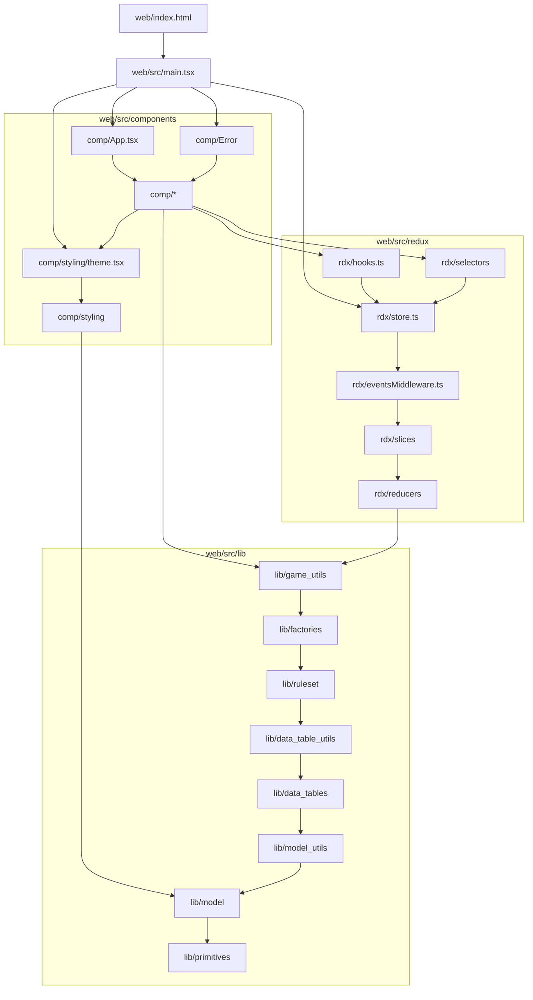
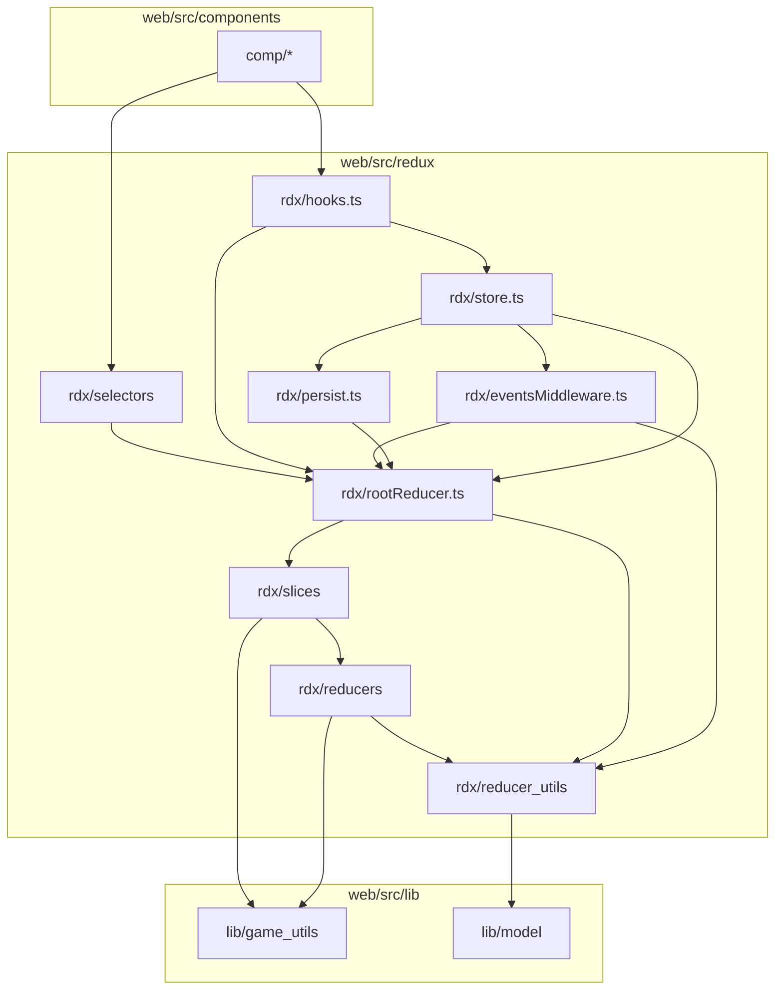
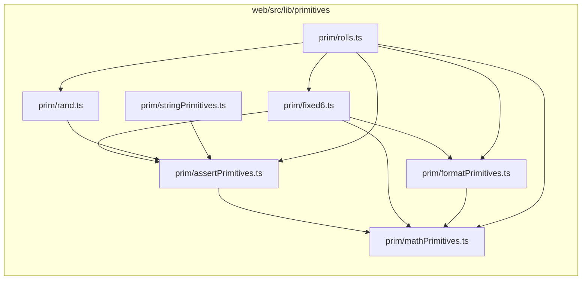

# About code dependencies

- [About code dependencies](#about-code-dependencies)
- [General import rules](#general-import-rules)
- [Import rules for the test directory](#import-rules-for-the-test-directory)
- [Directory import rules](#directory-import-rules)
  - [Redux directory import rules](#redux-directory-import-rules)
  - [Primitives directory import rules](#primitives-directory-import-rules)
- [See also](#see-also)

This document explains what are the code dependencies rules, i.e. rules about
which files can `import` which symbols from other files.

# General import rules

- No import cycles are allowed.
- Any code in this codebase can import external code, unless explicitly stated otherwise.
- The code in `web/src/lib/` can not depend on `react` nor `@mui` external code.
- Only code in `web/src/redux/` can depend on `@reduxjs` external code.
- By default, code in files being directly in any given directory `dir`:
  - Can import `external code`, referenced in `package.json`.
  - Can import any other code from the same directory and all its subdirectories.
  - Cannot import any code from other directories than itself, unless state otherwise by other rules.
- Defaults can be overridden by more rules for specific directories.

# Import rules for the test directory

Code in `web/test/` directory can import code in `web/src/` directory, following the import rules
of the `web/src/` directory. This means that:

- If `web/src/foo` can depend on `web/src/bar`, then `test` for `foo` can import both `web/src/foo` and `web/src/bar`.
- If `web/src/foo` can not depend on `web/src/qux`, then `test` for `foo` can not import `web/src/qux`.

# Directory import rules

The diagram below defines the directory import rules for the codebase.

An entry `Foo --> Bar` means that directory or file `Foo` can depend on directory or file `Bar`
and on all directories or files on which `Bar` can depend, recursively.

As such:
- The first listed directory can depend on all other listed directories.
- The last listed directory can not depend on any other listed directories.

Directory import rules for dirs in `src/` dir:

## Redux directory import rules

Detailed dependency rules within the `web/src/redux/` directory:

## Primitives directory import rules

Detailed dependency rules within the `web/src/lib/primitives/` directory:

# See also

- [About top-level app initialization](about_top_level_app_init.md)
- [About game state initialization](about_game_state_init.md)

// KJA1 question: do data_tables need to depend on model? Why?
