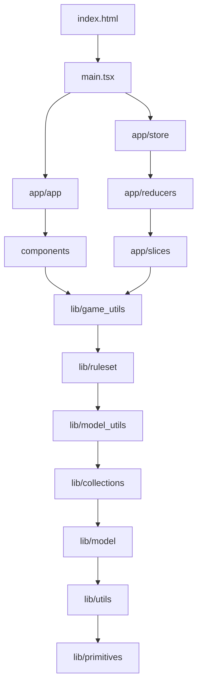

# About code dependencies

This document explains what are the code dependencies rules, i.e. rules about
which files can `import` which symbols from other files.

# Assumptions made in this document

> [!IMPORTANT]
> Assume that current directory for this document purposes is `web/`

# General import rules

- No import cycles are allowed.
- Any code in this codebase can import external code, unless explicitly stated otherwise.
- By default, code in files being directly in any given directory `dir`:
  - Can import `external code`, referenced in `package.json`.
  - Can import any other code from the same directory and all its subdirectories.
  - Cannot import any code from other directories than itself, unless state otherwise by other rules.
- Defaults can be overridden by more rules for specific directories.

# Import rules for the test directory

Code in `test/` directory can import code in `src/` directory, following the import rules
of the `src/` directory. This means that:

- If `src/foo` can depend on `src/bar`, then `test` for `foo` can import both `src/foo` and `src/bar`.
- If `src/foo` can not depend on `src/qux`, then `test` for `foo` can not import `src/qux`.

# Directory import rules

The diagram below defines the directory import rules for the codebase.

An entry `Foo --> Bar` means that directory or file `Foo` can depend on directory or file `Bar`
and on all directories or files on which `Bar` can depend, recursively.

As such:
- The first listed directory can depend on all other listed directories.
- The last listed directory can not depend on any other listed directories.

Directory import rules for dirs in `src/` dir:

