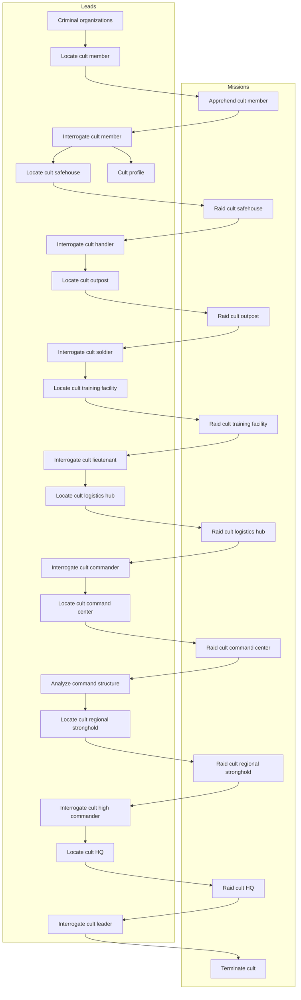

# Data tables reference

This document lists table with core game collections like leads, missions, enemy units, etc.

# Baseline agent stats

Newly hired agent has:

- 30 hit points
- 100 skill
- 10 damage weapon, meaning it has a damage range of 5-15

# Enemy units

Refer to [enemyStatsTables.ts](../../web/src/lib/collections/enemyStatsTables.ts).

# Offensive missions

Refer to [missionStatsTables.ts](../../web/src/lib/collections/missionStatsTables.ts).

# Defensive missions / Faction operations

Refer to [missionStatsTables.ts](../../web/src/lib/collections/missionStatsTables.ts).

# Faction operation level rewards and penalties

Refer to [operationLevelStatsTables.ts](../../web/src/lib/collections/operationLevelStatsTables.ts).

# Leads

The leads system follows a progression chain where completing missions unlocks new investigation opportunities.

| ID                              | Difficulty | Repeatable |
| ------------------------------- | ---------: | :--------: |
| Criminal organizations          |          1 |   false    |
| Locate cult member              |          2 |    true    |
| Interrogate cult member         |          2 |   false    |
| Locate cult safehouse           |         10 |    true    |
| Cult profile                    |          5 |   false    |
| Interrogate cult handler        |          2 |   false    |
| Locate cult outpost             |         20 |    true    |
| Interrogate cult soldier        |          4 |   false    |
| Locate cult training facility   |         30 |    true    |
| Interrogate cult lieutenant     |          6 |   false    |
| Locate cult logistics hub       |         40 |    true    |
| Interrogate cult commander      |         10 |   false    |
| Locate cult command center      |         60 |    true    |
| Analyze command structure       |         15 |   false    |
| Locate cult regional stronghold |         80 |    true    |
| Interrogate cult high commander |         20 |   false    |
| Locate cult HQ                  |        100 |   false    |
| Interrogate cult leader         |         30 |   false    |
| Terminate cult                  |        150 |   false    |

# Dependency diagram

The diagram below shows the dependencies between leads and missions.

<!-- cspell:disable -->

<!-- cspell:enable -->
