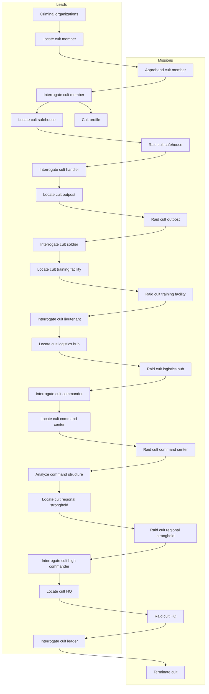

# Data tables reference

This document lists table with core game collections like leads, missions, enemy units, etc.

# Baseline agent stats

Newly hired agent has:

- 30 hit points
- 100 skill
- 10 damage weapon, meaning it has a damage range of 5-15

# Enemy units

| Cult unit      | Officer | Alias   | Skill | HP  | Wpn |
| -------------- | :-----: | ------- | :---: | :-: | :-: |
| Initiate       |         | In Init |  40   | 20  |  8  |
| Operative      |         | Op Oper |  60   | 20  | 10  |
| Handler        |   yes   | Hn Hndl |  70   | 20  | 10  |
| Soldier        |         | Sl Sldr |  100  | 30  | 14  |
| Lieutenant     |   yes   | Lt Ltnt |  120  | 30  | 14  |
| Elite          |         | El Elit |  200  | 40  | 20  |
| Commander      |   yes   | Cm Cmdr |  250  | 40  | 20  |
| High Commander |   yes   | HC HCmd |  400  | 50  | 30  |
| Cult leader    |   yes   | CL CLdr |  800  | 80  | 40  |

Typical ratios:

- 1 handler for 5-8 initiates or operatives
- 1 lieutenant for 2-3 handlers and 4-5 soldiers
- 1 commander for 2 lieutenants and 2-4 elites
- 1 high commander for 3-4 commanders and 4-8 elites

# Offensive missions

The table below shows some of the details of player offensive missions.

| Mission                       | ExpIn | Troops                      | Officers                      | MoneyR | FundR |  PanicR | Suppr. |
| ----------------------------- | ----- | --------------------------- | ----------------------------- | -----: | ----: | ------: | -----: |
| Apprehend cult member         |    5  |  2 In,   1 Op               |                               |      5 |     0 |  0.05 % |      0 |
| Raid cult safehouse           |    8  |  4 In,   4 Op               | 1 Hn                          |    100 |     5 |  0.1  % |      1 |
| Raid cult outpost             |   10  |  8 In,   8 Op,  2 Sl        | 3 Hn                          |    400 |    10 |  0.5  % |    1-3 |
| Raid cult training facility   |   12  | 30 In,  16 Op,  4 Sl        | 6 Hn,  1 Lt                   |    800 |    15 |    1  % |    3-9 |
| Raid cult logistics hub       |   15  | 12 In,  24 Op, 10 Sl,  2 El | 5 Hn,  2 Lt, 1 Cm             |  2,000 |    20 |    2  % |   5-15 |
| Raid cult command center      |   20  |  - In,  20 Op, 20 Sl,  6 El | 4 Hn,  4 Lt, 3 Cm             |  3,000 |    25 |    5  % |  10-30 |
| Raid cult regional stronghold |   30  |  - In,   - Op, 40 Sl, 10 El | - Hn,  8 Lt, 3 Cm, 1 HC       |  5,000 |    50 |   10  % |  15-45 |
| Raid cult HQ                  |   40  |  - In,   - Op, 60 Sl, 20 El | - Hn, 12 Lt, 6 Cm, 2 HC, 1 CL | 10,000 |   100 |   20  % |    N/A |

For descriptions see https://chatgpt.com/g/g-p-684e89e14dbc8191a947cc29c20ee528-game-ts/c/69367e41-e044-8332-baa8-f61660ca87af

Legend:
`Exp` - In how many turns the mission expires.
`Troops` - What troop-type enemies are present on the mission.
`Officers` - What officer-type enemies are present on the mission.
`MoneyR` - Money reward.
`FundR` - Funding reward.
`IntelR` - Intel reward.
`PanicR` - Panic reduction.
`ThreatR` - Threat reduction of given faction.
`SupprR` - Suppression reward (increase) of given faction.

# Defensive missions / Faction operations

The table below shows some of the details of player defensive missions, to counter faction operations.

| Mission                                  | Lvl | ExpIn | Troops                     | Officers                |
| ---------------------------------------- | :-: | ----- | -------------------------- | ----------------------- |
| Foil recruitment push                    |  1  |    3  |  4 In,  1 Op,    Sl,    El |    Hn,   Lt,   Cm,   HC |
| Foil supply theft                        |  1  |    3  |  4 In,  3 Op,    Sl,    El |    Hn,   Lt,   Cm,   HC |
| Foil business extortion                  |  1  |    3  |  6 In,  2 Op,    Sl,    El |  1 Hn,   Lt,   Cm,   HC |
|                                          |     |       |                            |                         |
| Foil sabotage                            |  2  |    4  |  2 In,  2 Op,  1 Sl,    El |  1 Hn,   Lt,   Cm,   HC |
| Foil VIP assassination                   |  2  |    4  |  4 In,  4 Op,  2 Sl,    El |  1 Hn,   Lt,   Cm,   HC |
| Defend against office raid               |  2  |    4  | 10 In,  6 Op,  4 Sl,    El |  2 Hn, 1 Lt,   Cm,   HC |
|                                          |     |       |                            |                         |
| Foil financial heist                     |  3  |    5  | 10 In, 10 Op,  8 Sl,    El |  4 Hn, 2 Lt,   Cm,   HC |
| Intercept arms deal                      |  3  |    5  | 12 In, 12 Op, 10 Sl,  2 El |  4 Hn, 2 Lt, 1 Cm,   HC |
| Defend against facility raid             |  3  |    5  | 16 In, 12 Op, 12 Sl,  2 El |  6 Hn, 3 Lt, 1 Cm,   HC |
|                                          |     |       |                            |                         |
| Counter civilian terror                  |  4  |    6  | 30 In, 24 Op, 15 Sl,  2 El | 10 Hn, 3 Lt, 1 Cm,   HC |
| Defend against city government assault   |  4  |    6  | 20 In, 16 Op, 20 Sl,  4 El |  6 Hn, 4 Lt, 2 Cm,   HC |
| Defend against retaliation strike        |  4  |    6  | 10 In,  6 Op, 24 Sl,  6 El |  2 Hn, 6 Lt, 3 Cm,   HC |
|                                          |     |       |                            |                         |
| Foil nuclear plant bombing               |  5  |    7  |    In,    Op,    Sl,  8 El |    Hn,   Lt, 3 Cm, 1 HC |
| Foil coup attempt                        |  5  |    7  |    In,    Op,    Sl,    El |    Hn,   Lt,   Cm, 1 HC |
| Defend military installation             |  5  |    7  |    In,    Op,    Sl,    El |    Hn,   Lt,   Cm, 1 HC |
|                                          |     |       |                            |                         |
| Defend against HQ assault                |  6  |    8  |    In,    Op,    Sl,    El |    Hn,   Lt,   Cm, 1 HC |

Legend:
`Lvl` - Mission level (1-6), indicating difficulty tier.
`Exp` - In how many turns the mission expires.
`Troops` - What troop-type enemies are present on the mission.
`Officers` - What officer-type enemies are present on the mission.
`Money` - Money reward.
`Fund` - Funding reward on success / penalty on failure (negative = funding loss).

Level description:
- Level 1 = soft operations
- Level 2 = violent but small-scale
- Level 3 = strategic threats
- Level 4 = regional destabilization
- Level 5 = global conflict
- Level 6 = existential

# Faction operation level rewards and penalties

When a faction operation succeeds (defensive mission expires or fails), rewards and penalties are applied based on the operation level.

| Level | Description                | Panic increase | Money | Fund R/P   |
| :---: | -------------------------- | :------------: | :---: | :--------: |
| 1     | Soft operations            |     0.02 %     |   10  |   0 /    0 |
| 2     | Violent but small-scale    |     0.1  %     |   30  |   5 /   -1 |
| 3     | Strategic threats          |     0.3  %     |  100  |  20 /   -4 |
| 4     | Regional destabilization   |     1    %     |  300  |  40 /   -8 |
| 5     | Global conflict            |     3    %     | 1000  |  80 /  -16 |
| 6     | Existential                |     0    %     |   0   |   0 /    0 |
| -     | SolPar offensive missions  |     0    %     |   0   |   0 /    0 |

Note:
- All player offensive missions have undefined operation level (no operation level).
- Level 6 existential has no penalties or rewards except: if the player fails to complete the mission, it is game over.

Legend:
`Panic increase` - Panic increase if the player fails to complete the defensive mission.
`Money` - Money reward if the player completes the defensive mission.
`Fund R/P` - Funding reward or penalty depending on whether the player completes the defensive mission.

# Leads

The leads system follows a progression chain where completing missions unlocks new investigation opportunities.

| ID                              | Difficulty | Repeatable |
| ------------------------------- | ---------: | :--------: |
| Criminal organizations          |          1 |   false    |
| Locate cult member              |          2 |    true    |
| Interrogate cult member         |          2 |   false    |
| Locate cult safehouse           |         10 |    true    |
| Cult profile                    |          5 |   false    |
| Interrogate cult handler        |          2 |   false    |
| Locate cult outpost             |         20 |    true    |
| Interrogate cult soldier        |          4 |   false    |
| Locate cult training facility   |         30 |    true    |
| Interrogate cult lieutenant     |          6 |   false    |
| Locate cult logistics hub       |         40 |    true    |
| Interrogate cult commander      |         10 |   false    |
| Locate cult command center      |         60 |    true    |
| Analyze command structure       |         15 |   false    |
| Locate cult regional stronghold |         80 |    true    |
| Interrogate cult high commander |         20 |   false    |
| Locate cult HQ                  |        100 |   false    |
| Interrogate cult leader         |         30 |   false    |
| Terminate cult                  |        150 |   false    |

# Dependency diagram

The diagram below shows the dependencies between leads and missions.

<!-- cspell:disable -->

<!-- cspell:enable -->
