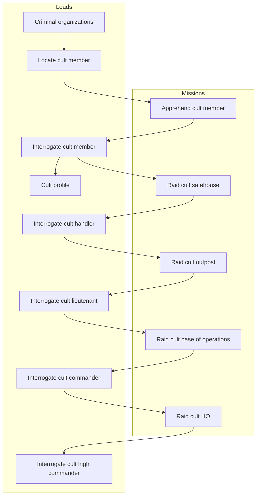

# Data tables reference

This document lists table with core game collections like leads, missions, enemy units, etc.

# Baseline agent stats

Newly hired agent has:

- 30 hit points
- 100 skill
- 10 damage weapon, meaning it has a damage range of 5-15

# Enemy units

| Cult unit      | Officer | Alias   | Skill | HP  |    Damage    |
| -------------- | :-----: | ------- | :---: | :-: | :----------: |
| Initiate       |         | In Init |  40   | 20  | 8 (  4-12 )  |
| Operative      |         | Op Oper |  60   | 20  | 10 (  5-15 ) |
| Handler        |   yes   | Hn Hndl |  70   | 20  | 10 (  5-15 ) |
| Soldier        |         | Sl Sldr |  100  | 30  | 14 (  7-21 ) |
| Lieutenant     |   yes   | Lt Ltnt |  120  | 30  | 14 (  7-21 ) |
| Elite          |         | El Elit |  200  | 40  | 20 ( 10-30 ) |
| Commander      |   yes   | Cm Cmdr |  250  | 40  | 20 ( 10-30 ) |
| High Commander |   yes   | HC HCmd |  400  | 50  | 30 ( 15-45 ) |

# Missions

The table below shows some of the details of missions.

`Enemies` - What enemies are present on the mission.
`Money` - Money reward.
`Intel` - Intel reward.
`PanicR` - Panic reduction. 100 = 1%.
`ThreatR` - Threat reduction of given faction. 100 = 1%.
`Suppr` - Suppression of given faction. 100 = 1%.

| Mission                      | Troops                    | Officers               | Money | Intel | PanicR | ThreatR | Suppr |
| ---------------------------- | ------------------------- | ---------------------- | :---: | :---: | :----: | :-----: | :---: |
| Apprehend cult member        | 2 In,  1 Op               |                        |  10   |  10   | 0.05 % | 0.01 %  | 0.1 % |
| Raid cult safehouse          | 4 In,  3 Op               | 1 Hn                   |  100  |  30   | 0.2 %  |  0.1 %  | 10 %  |
| Raid cult outpost            | 4 In,  6 Op,  4 Sl        | 2 Hn, 1 Lt             |  200  |  60   |  1 %   |   2 %   | 50 %  |
| Raid cult base of operations | -      10 Op, 10 Sl, 2 El | 4 Hn, 2 Lt, 1 Cm       |  300  |  100  |  5 %   |  10 %   | 100 % |
| Raid cult HQ                 | -             20 Sl, 6 El | -     4 Lt, 2 Cm, 1 HC | 1000  |  300  |  20 %  |  100 %  | 100 % |

# Leads

The leads system follows a progression chain where completing missions unlocks new investigation opportunities.

| Item                            | Intel Cost | Repeatable | Dependencies                  |
| ------------------------------- | :--------: | :--------: | ----------------------------- |
| Criminal organizations          |     20     |   false    | Starting lead                 |
| Locate cult member              |     20     |    true    | Criminal organizations        |
| Interrogate cult member         |     0      |   false    | Apprehend cult member mission |
| Cult profile                    |     50     |   false    | Interrogate cult member       |
| Interrogate cult handler        |     0      |   false    | Raid cult safehouse mission   |
| Interrogate cult lieutenant     |     0      |   false    | Raid cult outpost mission     |
| Interrogate cult commander      |     0      |   false    | Raid cult base mission        |
| Interrogate cult high commander |     0      |   false    | Raid cult HQ mission          |
| Raid cult safehouse             |     0      |   false    | Interrogate cult member       |
| Raid cult outpost               |     0      |   false    | Interrogate cult handler      |
| Raid cult base of operations    |     0      |   false    | Interrogate cult lieutenant   |
| Raid cult HQ                    |     0      |   false    | Interrogate cult commander    |

# Dependency diagram

The diagram below shows the dependencies between leads and missions.

<!-- cspell:disable -->

<!-- cspell:enable -->
