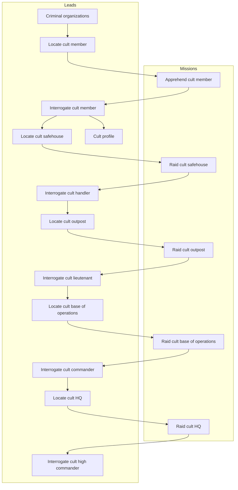

# Data tables reference

This document lists table with core game collections like leads, missions, enemy units, etc.

# Baseline agent stats

Newly hired agent has:

- 30 hit points
- 100 skill
- 10 damage weapon, meaning it has a damage range of 5-15

# Enemy units

| Cult unit      | Officer | Alias   | Skill | HP  |    Damage    |
| -------------- | :-----: | ------- | :---: | :-: | :----------: |
| Initiate       |         | In Init |  40   | 20  | 8 (  4-12 )  |
| Operative      |         | Op Oper |  60   | 20  | 10 (  5-15 ) |
| Handler        |   yes   | Hn Hndl |  70   | 20  | 10 (  5-15 ) |
| Soldier        |         | Sl Sldr |  100  | 30  | 14 (  7-21 ) |
| Lieutenant     |   yes   | Lt Ltnt |  120  | 30  | 14 (  7-21 ) |
| Elite          |         | El Elit |  200  | 40  | 20 ( 10-30 ) |
| Commander      |   yes   | Cm Cmdr |  250  | 40  | 20 ( 10-30 ) |
| High Commander |   yes   | HC HCmd |  400  | 50  | 30 ( 15-45 ) |

# Offensive missions

The table below shows some of the details of player offensive missions.

| Mission                      | Exp | Troops                    | Officers               | MoneyR | FundR | IntelR | PanicR | ThreatR | SupprR |
| ---------------------------- | --- | ------------------------- | ---------------------- | -----: | ----: | -----: | -----: | ------: | -----: |
| Apprehend cult member        | 3   | 2 In,   1 Op              |                        |      5 |     0 |      0 | 0.05 % |  0.01 % |  0.1 % |
| Raid cult safehouse          | 8   | 4 In,   3 Op              | 1 Hn                   |    100 |     5 |     10 |  0.2 % |   0.1 % |   10 % |
| Raid cult outpost            | 10  | 4 In,   6 Op,  4 Sl       | 2 Hn, 1 Lt             |    400 |    10 |     20 |    1 % |     1 % |   50 % |
| Raid cult base of operations | 12  | -      10 Op, 10 Sl, 2 El | 4 Hn, 2 Lt, 1 Cm       |  1,000 |    20 |     50 |    5 % |     5 % |  100 % |
| Raid cult HQ                 | 15  | -             20 Sl, 6 El | -     4 Lt, 2 Cm, 1 HC |  5,000 |    50 |    100 |   20 % |   100 % |  100 % |

Legend:
`Exp` - In how many turns the mission expires.
`Troops` - What troop-type enemies are present on the mission.
`Officers` - What officer-type enemies are present on the mission.
`MoneyR` - Money reward.
`FundR` - Funding reward.
`IntelR` - Intel reward.
`PanicR` - Panic reduction.
`ThreatR` - Threat reduction of given faction.
`SupprR` - Suppression reward (increase) of given faction.

# Counter-offensive missions

The table below shows some of the details of player counter-offensive missions against faction offensive missions.

Level 1: soft operations
- Foil recruitment push
- Foil business extortion
- Foil supply theft

Level 2: violent but small-scale
- Foil sabotage
- Foil VIP assassination
- Defend against office raid

Level 3: strategic threats
- Foil financial heist
- Intercept arms deal
- Defend against facility raid

Level 4: regional destabilization
- Defend against city government assault
- Counter civilian terror
- Defend against cult retaliation strike

Level 5: global threats
- Foil nuclear plant bombing
- Defend against HQ assault

TODO - update

| Mission                      | Exp | Troops                    | Officers               | MoneyR | FundR | IntelR | PanicR | ThreatR | SupprR |
| ---------------------------- | --- | ------------------------- | ---------------------- | -----: | ----: | -----: | -----: | ------: | -----: |
| Apprehend cult member        | 3   | 2 In,   1 Op              |                        |      5 |     0 |      0 | 0.05 % |  0.01 % |  0.1 % |
| Raid cult safehouse          | 8   | 4 In,   3 Op              | 1 Hn                   |    100 |     5 |     10 |  0.2 % |   0.1 % |   10 % |
| Raid cult outpost            | 10  | 4 In,   6 Op,  4 Sl       | 2 Hn, 1 Lt             |    400 |    10 |     20 |    1 % |     1 % |   50 % |
| Raid cult base of operations | 12  | -      10 Op, 10 Sl, 2 El | 4 Hn, 2 Lt, 1 Cm       |  1,000 |    20 |     50 |    5 % |     5 % |  100 % |
| Raid cult HQ                 | 15  | -             20 Sl, 6 El | -     4 Lt, 2 Cm, 1 HC |  5,000 |    50 |    100 |   20 % |   100 % |  100 % |

Legend:
`Exp` - In how many turns the mission expires.
`Troops` - What troop-type enemies are present on the mission.
`Officers` - What officer-type enemies are present on the mission.
`Money` - Money reward / penalty.
`Fund` - Funding reward / penalty.
`Intel` - Intel reward / penalty.
`Panic` - Panic reduction / penalty.
`Threat` - Threat reduction / penalty of given faction.
`Suppr` - Suppression reward / penalty of given faction.

# Leads

The leads system follows a progression chain where completing missions unlocks new investigation opportunities.

| ID                              | Intel Cost | Repeatable |
| ------------------------------- | ---------: | :--------: |
| Criminal organizations          |         10 |   false    |
| Cult profile                    |         50 |   false    |
| Locate cult member              |         20 |    true    |
| Locate cult safehouse           |         50 |    true    |
| Locate cult outpost             |        100 |    true    |
| Locate cult base of operations  |        200 |    true    |
| Locate cult HQ                  |        500 |    true    |
| Interrogate cult member         |          0 |   false    |
| Interrogate cult handler        |          0 |   false    |
| Interrogate cult lieutenant     |          0 |   false    |
| Interrogate cult commander      |          0 |   false    |
| Interrogate cult high commander |          0 |   false    |

# Dependency diagram

The diagram below shows the dependencies between leads and missions.

<!-- cspell:disable -->

<!-- cspell:enable -->
