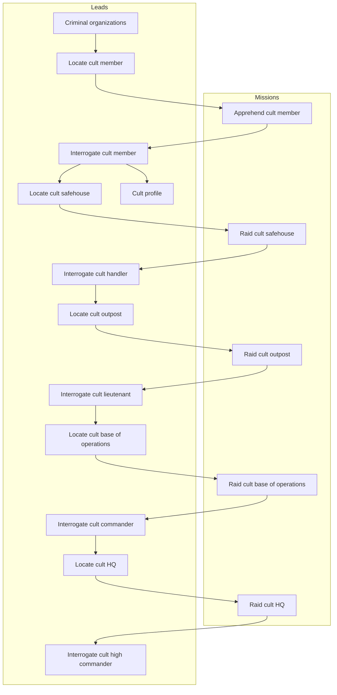

# Data tables reference

This document lists table with core game collections like leads, missions, enemy units, etc.

# Baseline agent stats

Newly hired agent has:

- 30 hit points
- 100 skill
- 10 damage weapon, meaning it has a damage range of 5-15

# Enemy units

| Cult unit      | Officer | Alias   | Skill | HP  |    Damage    |
| -------------- | :-----: | ------- | :---: | :-: | :----------: |
| Initiate       |         | In Init |  40   | 20  | 8 (  4-12 )  |
| Operative      |         | Op Oper |  60   | 20  | 10 (  5-15 ) |
| Handler        |   yes   | Hn Hndl |  70   | 20  | 10 (  5-15 ) |
| Soldier        |         | Sl Sldr |  100  | 30  | 14 (  7-21 ) |
| Lieutenant     |   yes   | Lt Ltnt |  120  | 30  | 14 (  7-21 ) |
| Elite          |         | El Elit |  200  | 40  | 20 ( 10-30 ) |
| Commander      |   yes   | Cm Cmdr |  250  | 40  | 20 ( 10-30 ) |
| High Commander |   yes   | HC HCmd |  400  | 50  | 30 ( 15-45 ) |

# Offensive missions

The table below shows some of the details of player offensive missions.

| Mission                      | Exp | Troops                    | Officers               | MoneyR | FundR | IntelR | PanicR | ThreatR | SupprR |
| ---------------------------- | --- | ------------------------- | ---------------------- | -----: | ----: | -----: | -----: | ------: | -----: |
| Apprehend cult member        | 3   | 2 In,   1 Op              |                        |      5 |     0 |      0 | 0.05 % |  0.01 % |  0.1 % |
| Raid cult safehouse          | 8   | 4 In,   3 Op              | 1 Hn                   |    100 |     5 |     10 |  0.2 % |   0.1 % |   10 % |
| Raid cult outpost            | 10  | 4 In,   6 Op,  4 Sl       | 2 Hn, 1 Lt             |    400 |    10 |     20 |    1 % |     1 % |   50 % |
| Raid cult base of operations | 12  | -      10 Op, 10 Sl, 2 El | 4 Hn, 2 Lt, 1 Cm       |  1,000 |    20 |     50 |    5 % |     5 % |  100 % |
| Raid cult HQ                 | 15  | -             20 Sl, 6 El | -     4 Lt, 2 Cm, 1 HC |  5,000 |    50 |    100 |   20 % |   100 % |  100 % |

Legend:
`Exp` - In how many turns the mission expires.
`Troops` - What troop-type enemies are present on the mission.
`Officers` - What officer-type enemies are present on the mission.
`MoneyR` - Money reward.
`FundR` - Funding reward.
`IntelR` - Intel reward.
`PanicR` - Panic reduction.
`ThreatR` - Threat reduction of given faction.
`SupprR` - Suppression reward (increase) of given faction.

# Defensive missions

The table below shows some of the details of player defensive missions, to counter faction offensive operations.

| Mission                                  | Lvl | Exp | Troops                    | Officers               | Money | Fund       | Intel | Panic            | Threat           | Suppr  |
| ---------------------------------------- | :-: | --- | ------------------------- | ---------------------- | ----: | ---------: | ----: | ---------------: | ---------------: | -----: |
| Foil recruitment push                    | 1   | 2   | 1 In,   1 Op              |                        |     0 |    0 / -0  |     5 |   0.1 % / -0.2 % |  0.02 % / -0.1 % |  0.2 % |
| Foil business extortion                  | 1   | 2   | 2 In                      |                        |     0 |    0 / -0  |     5 |  0.15 % / -0.3 % |  0.02 % / -0.1 % |  0.2 % |
| Foil supply theft                        | 1   | 3   | 2 In,   1 Op              |                        |    10 |    0 / -5  |    10 |   0.2 % / -0.4 % | 0.05 % / -0.15 % |  0.5 % |
| Foil sabotage                            | 2   | 3   | 2 In,   2 Op              |                        |     0 |    2 / -5  |    10 |   0.3 % / -0.6 % |  0.05 % / -0.2 % |    1 % |
| Foil VIP assassination                   | 2   | 4   | 3 In,   2 Op              | 1 Hn                   |     0 |   5 / -10  |    15 |     0.5 % / -1 % |   0.1 % / -0.3 % |    2 % |
| Defend against office raid               | 2   | 4   | 4 In,   3 Op              | 1 Hn                   |     0 |   5 / -10  |    15 |   0.8 % / -1.5 % |   0.1 % / -0.5 % |    3 % |
| Foil financial heist                     | 3   | 5   | 3 In,   4 Op,  2 Sl       | 1 Hn, 1 Lt             |    50 |   10 / -20 |    25 |       1 % / -2 % |   0.3 % / -0.8 % |    8 % |
| Intercept arms deal                      | 3   | 6   | 2 In,   5 Op,  3 Sl       | 2 Hn                   |   150 |   10 / -20 |    30 |     0.8 % / -2 % |     0.4 % / -1 % |   12 % |
| Defend against facility raid             | 3   | 6   | 4 In,   6 Op,  4 Sl       | 2 Hn, 1 Lt             |     0 |   10 / -25 |    25 |     1.5 % / -3 % |     0.5 % / -1 % |   15 % |
| Defend against city government assault   | 4   | 8   | -       8 Op,  6 Sl, 2 El | 3 Hn, 2 Lt, 1 Cm       |     0 |   15 / -30 |    40 |       3 % / -6 % |       2 % / -3 % |   30 % |
| Counter civilian terror                  | 4   | 8   | -       6 Op,  8 Sl, 3 El | 2 Hn, 2 Lt             |     0 |   15 / -40 |    50 |     5 % / -10 %  |     2.5 % / -4 % |   35 % |
| Defend against cult retaliation strike   | 4   | 10  | -      10 Op, 10 Sl, 4 El | 4 Hn, 3 Lt, 1 Cm       |     0 |   20 / -50 |    60 |       4 % / -8 % |       3 % / -5 % |   45 % |
| Foil nuclear plant bombing               | 5   | 12  | -             15 Sl, 5 El | -     3 Lt, 2 Cm       |     0 |  40 / -75  |    80 |    15 % / -25 %  |    10 % / -15 %  |   80 % |
| Defend against HQ assault                | 5   | 15  | -             20 Sl, 8 El | -     4 Lt, 3 Cm, 1 HC |     0 |  50 / -150 |   100 |    20 % / -30 %  |    15 % / -20 %  |  100 % |

Legend:
`Lvl` - Mission level (1-5), indicating difficulty tier.
`Exp` - In how many turns the mission expires.
`Troops` - What troop-type enemies are present on the mission.
`Officers` - What officer-type enemies are present on the mission.
`Money` - Money reward.
`Fund` - Funding reward on success / penalty on failure (negative = funding loss).
`Intel` - Intel reward.
`Panic` - Panic reduction on success / penalty on failure (negative = panic increase).
`Threat` - Threat reduction on success / penalty on failure (negative = threat increase).
`Suppr` - Suppression reward (increase) of given faction.

# Leads

The leads system follows a progression chain where completing missions unlocks new investigation opportunities.

| ID                              | Intel Cost | Repeatable |
| ------------------------------- | ---------: | :--------: |
| Criminal organizations          |         10 |   false    |
| Cult profile                    |         50 |   false    |
| Locate cult member              |         20 |    true    |
| Locate cult safehouse           |         50 |    true    |
| Locate cult outpost             |        100 |    true    |
| Locate cult base of operations  |        200 |    true    |
| Locate cult HQ                  |        500 |    true    |
| Interrogate cult member         |          0 |   false    |
| Interrogate cult handler        |          0 |   false    |
| Interrogate cult lieutenant     |          0 |   false    |
| Interrogate cult commander      |          0 |   false    |
| Interrogate cult high commander |          0 |   false    |

# Dependency diagram

The diagram below shows the dependencies between leads and missions.

<!-- cspell:disable -->

<!-- cspell:enable -->
